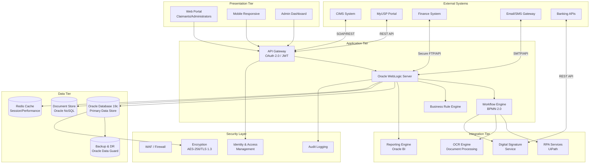
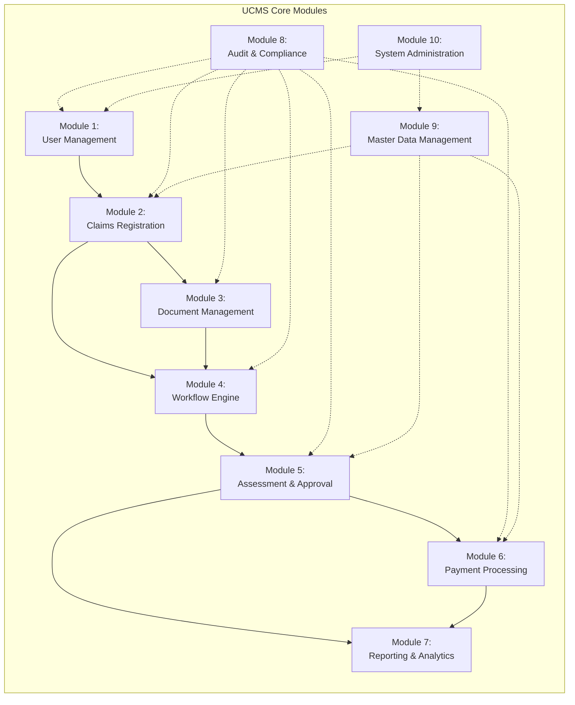
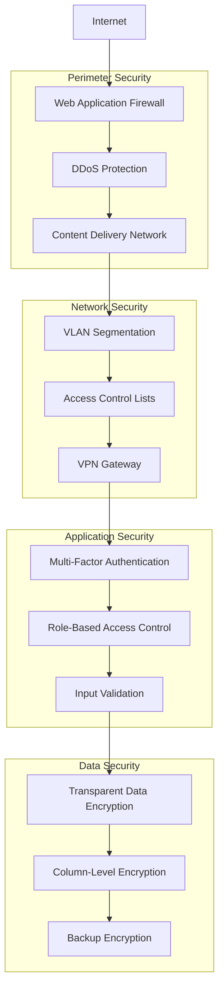
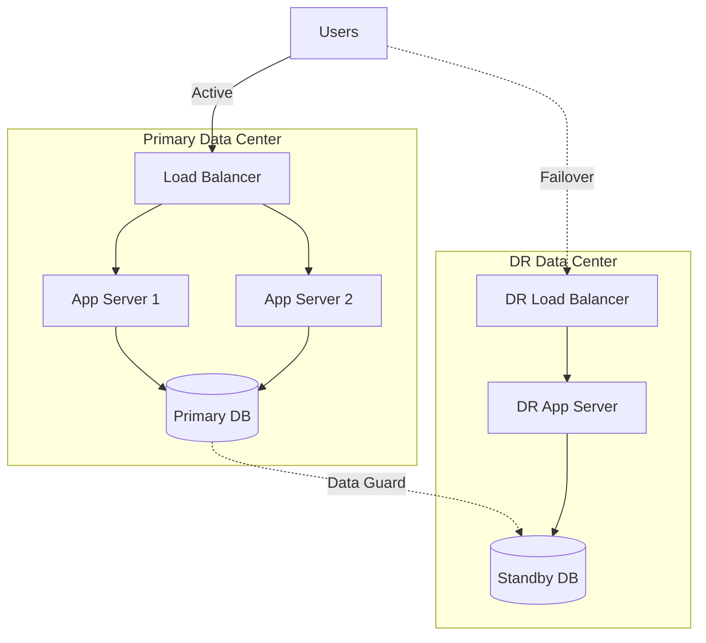

# ANNEX T1: SYSTEM ARCHITECTURE DIAGRAM
## TSH-2607: Universal Service Provision (USP) Claims Management System (UCMS)
**Document Reference:** ANNEX-T01-ARCHITECTURE-TSH2607.md  
**Version:** 1.0  
**Date:** January 2025  
**Classification:** Technical Annexure

---

## 1. EXECUTIVE SUMMARY

This annexure presents the comprehensive system architecture diagram for the USP Claims Management System (UCMS) developed for the Malaysian Communications and Multimedia Commission (MCMC). The architecture follows industry best practices for enterprise-grade Oracle-based solutions with integrated digital signature, RPA, and OCR capabilities.

**Cross-References:**
- URS Section 4.1: System Architecture Requirements
- BRS Section 3.2: Business Architecture
- SRS Section 5.1: Technical Architecture Specifications
- SDS Section 2.3: Solution Design Architecture

---

## 2. ARCHITECTURAL OVERVIEW

The UCMS architecture is designed as a multi-tier, service-oriented architecture (SOA) that ensures scalability, security, and maintainability. The system comprises 10 integrated modules supporting the complete lifecycle of USP claims management.

### 2.1 Architecture Layers

| Layer | Components | Technology Stack |
|-------|------------|------------------|
| **Presentation Layer** | Web Portal, Mobile Interface, Admin Dashboard | Oracle APEX, React.js, HTML5/CSS3 |
| **Application Layer** | Business Logic, API Gateway, Workflow Engine | Oracle Fusion Middleware, REST APIs |
| **Integration Layer** | RPA Bots, OCR Engine, Digital Signature Service | UiPath, Tesseract/OCR.space, Docusign/Adobe Sign |
| **Data Layer** | Database, Document Store, Cache | Oracle Database 19c/21c, Oracle NoSQL |
| **Infrastructure Layer** | Servers, Network, Security | Oracle Cloud Infrastructure (OCI) |

---

## 3. SYSTEM ARCHITECTURE DIAGRAM

---

## 4. MODULE ARCHITECTURE

The UCMS comprises 10 core modules as defined in the tender requirements:

### 4.1 Module Interaction Diagram

### 4.2 Module Descriptions

| Module | Name | Primary Function | Integration Points |
|--------|------|------------------|-------------------|
| M1 | User Management | Role-based access control, user provisioning | IAM, Active Directory |
| M2 | Claims Registration | Claim submission, validation, categorization | CIMS, MyUSP |
| M3 | Document Management | Document upload, OCR processing, storage | OCR Engine, DocStore |
| M4 | Workflow Engine | Process orchestration, routing, notifications | BPMN, Email Gateway |
| M5 | Assessment & Approval | Evaluation workflows, approval hierarchies | Rule Engine, Finance |
| M6 | Payment Processing | Payment calculation, disbursement tracking | Banking APIs, Finance |
| M7 | Reporting & Analytics | Dashboards, KPIs, statutory reports | Oracle BI, Data Warehouse |
| M8 | Audit & Compliance | Logging, trail maintenance, compliance checks | Audit DB, SIEM |
| M9 | Master Data Management | Reference data, lookup tables, configurations | Golden Record |
| M10 | System Administration | Configuration, monitoring, maintenance | OCI Console |

---

## 5. TECHNICAL SPECIFICATIONS

### 5.1 Infrastructure Requirements

| Component | Specification | Quantity |
|-----------|---------------|----------|
| Application Servers | Oracle WebLogic 14c, 16 CPU, 64GB RAM | 2 (HA Pair) |
| Database Servers | Oracle DB 19c Enterprise, 32 CPU, 128GB RAM | 2 (Primary/Standby) |
| RPA Servers | UiPath Server, 8 CPU, 32GB RAM | 2 |
| Load Balancer | Oracle Cloud Load Balancer | 2 (Active/Active) |
| Storage | Oracle Cloud Block Storage, 10TB SSD | As required |

### 5.2 Security Architecture

---

## 6. DEPLOYMENT ARCHITECTURE

### 6.1 High Availability Design

---

## 7. COMPLIANCE MAPPING

| Requirement ID | Description | Architecture Component | SDS Reference |
|----------------|-------------|------------------------|---------------|
| URS-ARCH-001 | Multi-tier architecture | All layers | SDS-2.1 |
| URS-ARCH-002 | High availability | DR configuration | SDS-2.4 |
| URS-ARCH-003 | Scalability | OCI Auto-scaling | SDS-2.5 |
| URS-SEC-001 | Encryption at rest | TDE, Column encryption | SDS-3.1 |
| URS-SEC-002 | Encryption in transit | TLS 1.3 | SDS-3.2 |
| URS-INT-001 | CIMS integration | API Gateway | SDS-4.1 |
| URS-INT-002 | MyUSP integration | REST API | SDS-4.2 |

---

## 8. DOCUMENT CONTROL

| Version | Date | Author | Changes |
|---------|------|--------|---------|
| 1.0 | January 2025 | Technical Team | Initial version |

---

**END OF ANNEX T1**
