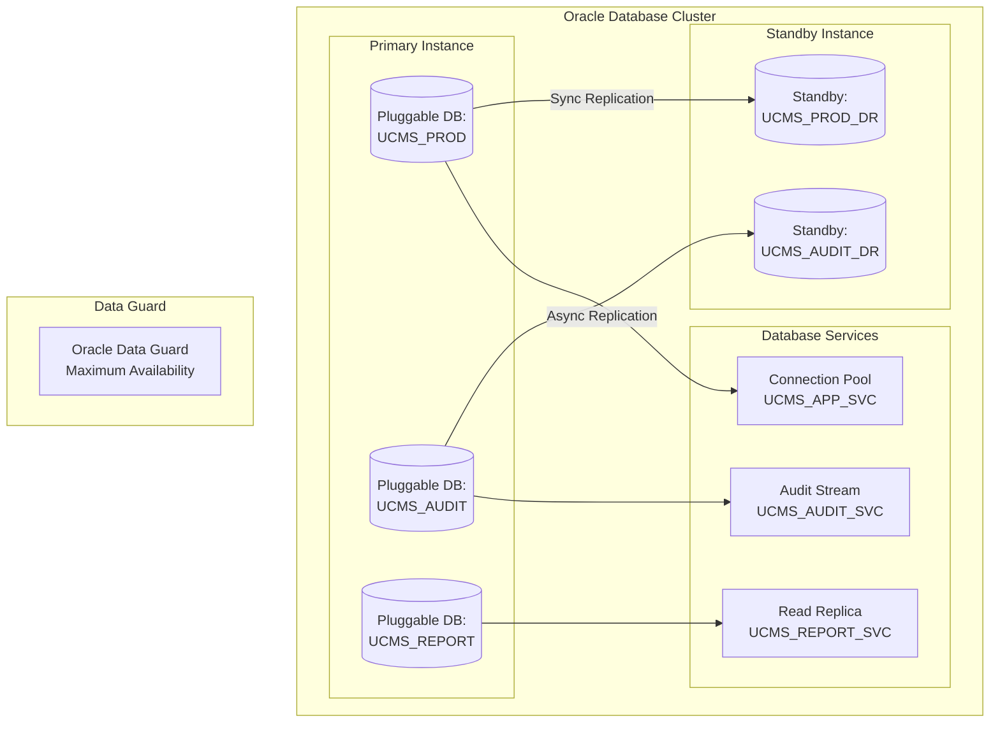
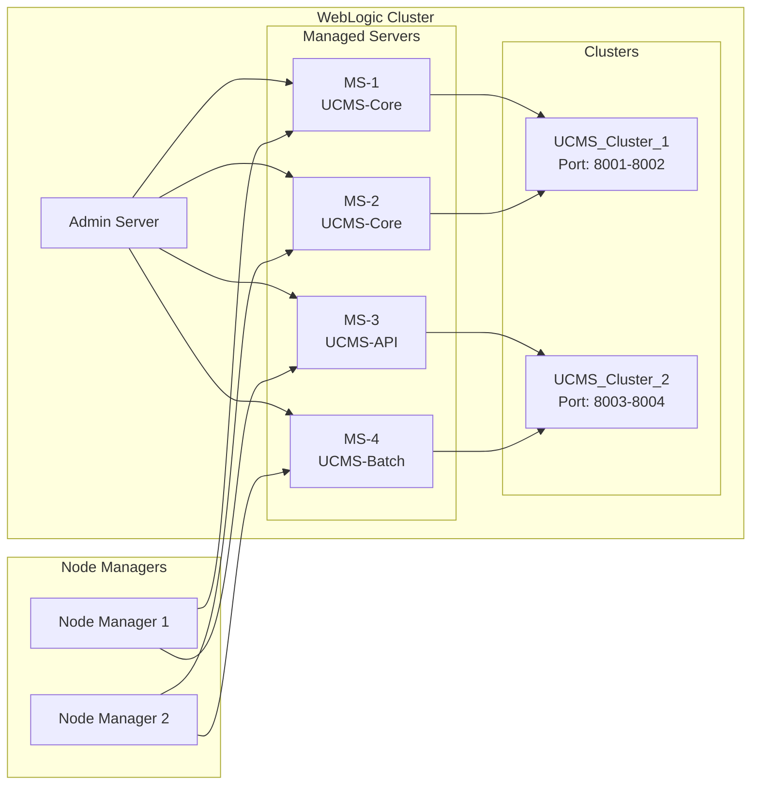
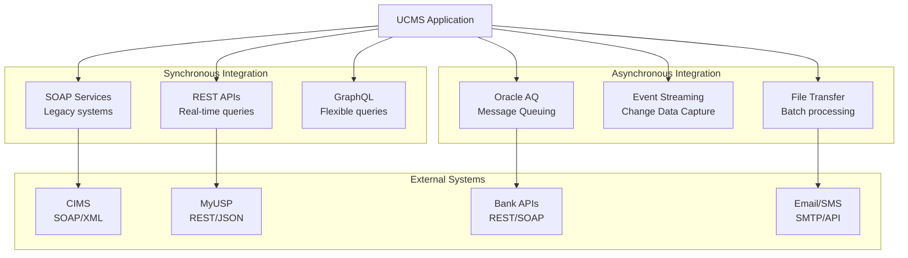
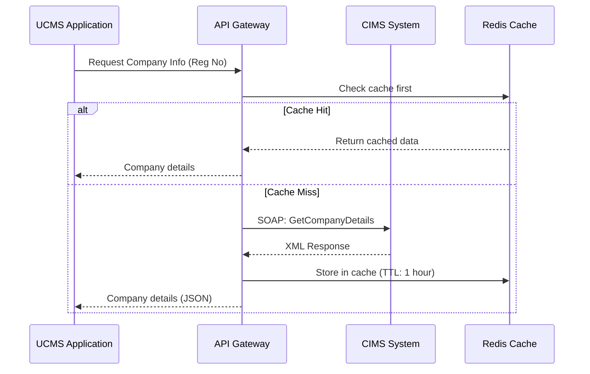
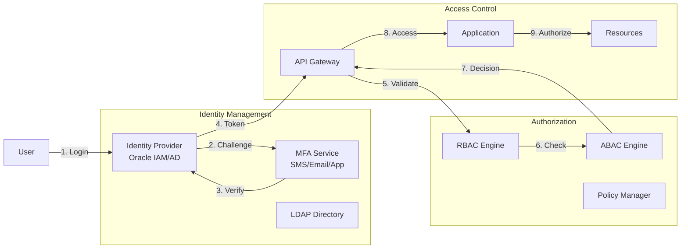
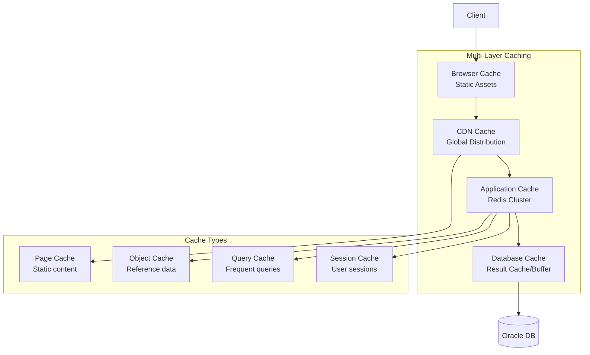
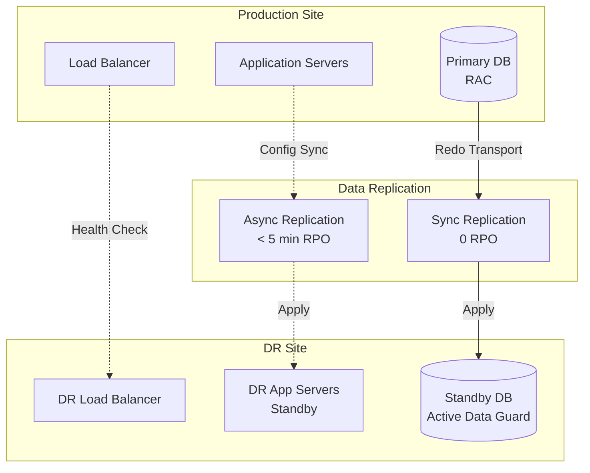
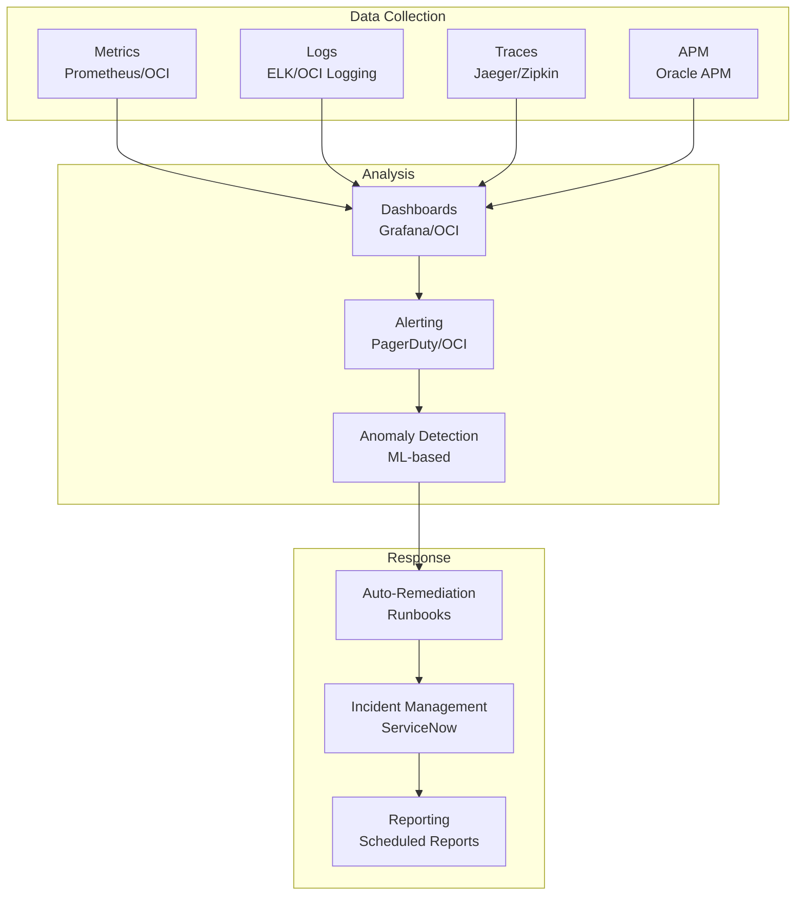

# ANNEX T2: DETAILED SYSTEM ARCHITECTURE
## TSH-2607: Universal Service Provision (USP) Claims Management System (UCMS)
**Document Reference:** ANNEX-T02-SYSTEM-ARCH-TSH2607.md  
**Version:** 1.0  
**Date:** January 2025  
**Classification:** Technical Annexure

---

## 1. INTRODUCTION

This annexure provides detailed system architecture specifications for the USP Claims Management System (UCMS). It elaborates on the technical components, integration patterns, and deployment strategies that underpin the solution.

**Cross-References:**
- URS Section 4: Technical Requirements
- BRS Section 3: Business Process Architecture
- SRS Section 5-7: System Design Specifications
- SDS Section 2: Solution Architecture

---

## 2. TECHNICAL ARCHITECTURE FRAMEWORK

### 2.1 Architecture Principles

| Principle | Description | Implementation |
|-----------|-------------|----------------|
| **Modularity** | Independent, interchangeable modules | 10 discrete modules with API interfaces |
| **Scalability** | Horizontal and vertical scaling capability | OCI auto-scaling, load balancing |
| **Security** | Defense in depth strategy | Multi-layer security controls |
| **Interoperability** | Seamless integration with external systems | Standard APIs, message queues |
| **Resilience** | Fault tolerance and disaster recovery | HA configuration, automated failover |
| **Maintainability** | Easy updates and maintenance | Microservices pattern, containerization |

### 2.2 Technology Stack Matrix

| Layer | Primary Technology | Alternative/Supporting | Version |
|-------|-------------------|------------------------|---------|
| Database | Oracle Database | Oracle NoSQL | 19c/21c |
| Application Server | Oracle WebLogic | Oracle Helidon | 14c |
| Development | Oracle APEX | Java/Spring Boot | 23.2+ |
| RPA | UiPath Enterprise | - | 2023.10+ |
| OCR | Tesseract + Custom ML | OCR.space API | 5.3+ |
| Digital Signature | Adobe Sign API | Docusign API | REST API v6 |
| Reporting | Oracle Analytics Cloud | Oracle BI Publisher | 2024 |
| Integration | Oracle Integration Cloud | Apache Camel | 3.x |
| Caching | Redis Enterprise | Oracle Coherence | 7.x |
| Message Queue | Oracle AQ | Apache Kafka | 21c |

---

## 3. COMPONENT ARCHITECTURE

### 3.1 Database Architecture

### 3.2 Database Schema Design

| Schema | Purpose | Key Tables | Estimated Volume |
|--------|---------|------------|------------------|
| **UCMS_CORE** | Core application data | CLAIMS, CLAIMANTS, PAYMENTS | 10M+ records |
| **UCMS_DOC** | Document metadata | DOCUMENTS, ATTACHMENTS, VERSIONS | 5M+ records |
| **UCMS_WF** | Workflow data | WORKFLOWS, TASKS, APPROVALS | 50M+ records |
| **UCMS_AUDIT** | Audit trails | AUDIT_LOG, ACCESS_LOG, CHANGES | 100M+ records |
| **UCMS_MDM** | Master data | LOOKUPS, CONFIGURATIONS, TAXONOMY | 100K+ records |
| **UCMS_INT** | Integration data | API_LOGS, MESSAGE_QUEUE, ERRORS | 25M+ records |

### 3.3 Application Server Architecture

---

## 4. INTEGRATION ARCHITECTURE

### 4.1 Integration Patterns

### 4.2 API Gateway Architecture

| API Category | Protocol | Authentication | Rate Limit |
|--------------|----------|----------------|------------|
| Public APIs | REST/HTTPS | OAuth 2.0 + API Key | 1000/hour |
| Partner APIs | REST/HTTPS | mTLS + OAuth 2.0 | 10000/hour |
| Internal APIs | REST/HTTPS | JWT + IP Whitelist | Unlimited |
| Legacy APIs | SOAP/HTTPS | Basic Auth + IP | 5000/hour |

### 4.3 CIMS Integration Details

---

## 5. SECURITY ARCHITECTURE

### 5.1 Authentication & Authorization Flow

### 5.2 Data Security Controls

| Data State | Control Mechanism | Implementation |
|------------|-------------------|----------------|
| **At Rest** | Transparent Data Encryption (TDE) | Oracle TDE with AES-256 |
| **At Rest** | Column-Level Encryption | Sensitive PII fields |
| **In Transit** | TLS Encryption | TLS 1.3 mandatory |
| **In Transit** | Certificate Pinning | Mobile applications |
| **In Use** | Memory Encryption | Secure enclaves where available |
| **Backup** | Backup Encryption | RMAN encryption |

---

## 6. PERFORMANCE ARCHITECTURE

### 6.1 Caching Strategy

### 6.2 Performance Targets

| Metric | Target | Measurement |
|--------|--------|-------------|
| Page Load Time | < 3 seconds | 95th percentile |
| API Response Time | < 500ms | Average |
| Database Query | < 100ms | Simple queries |
| Report Generation | < 30 seconds | Complex reports |
| Concurrent Users | 10,000+ | Simultaneous |
| Throughput | 1000 TPS | Peak load |

---

## 7. DISASTER RECOVERY ARCHITECTURE

### 7.1 DR Topology

### 7.2 Recovery Objectives

| Component | RTO | RPO | Strategy |
|-----------|-----|-----|----------|
| Database | 1 hour | 0 (Sync) | Active Data Guard |
| Application | 2 hours | 5 minutes | Warm standby |
| Documents | 4 hours | 15 minutes | Cross-region replication |
| Configuration | 30 minutes | 0 | GitOps, automated deployment |

---

## 8. MONITORING & OBSERVABILITY

### 8.1 Monitoring Stack

---

## 9. COMPLIANCE & GOVERNANCE

| Standard | Requirement | Implementation |
|----------|-------------|----------------|
| **PDPA** | Personal data protection | Encryption, access controls, audit |
| **ISO 27001** | Information security | ISMS implementation |
| **OWASP** | Application security | Top 10 mitigation |
| **MS ISO** | Malaysian standards | Compliance certification |
| **Audit** | Audit trail | Immutable logs, 7-year retention |

---

## 10. DOCUMENT CONTROL

| Version | Date | Author | Changes |
|---------|------|--------|---------|
| 1.0 | January 2025 | Technical Team | Initial version |

---

**END OF ANNEX T2**
