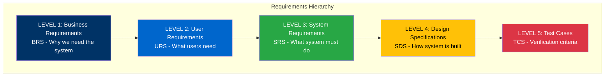
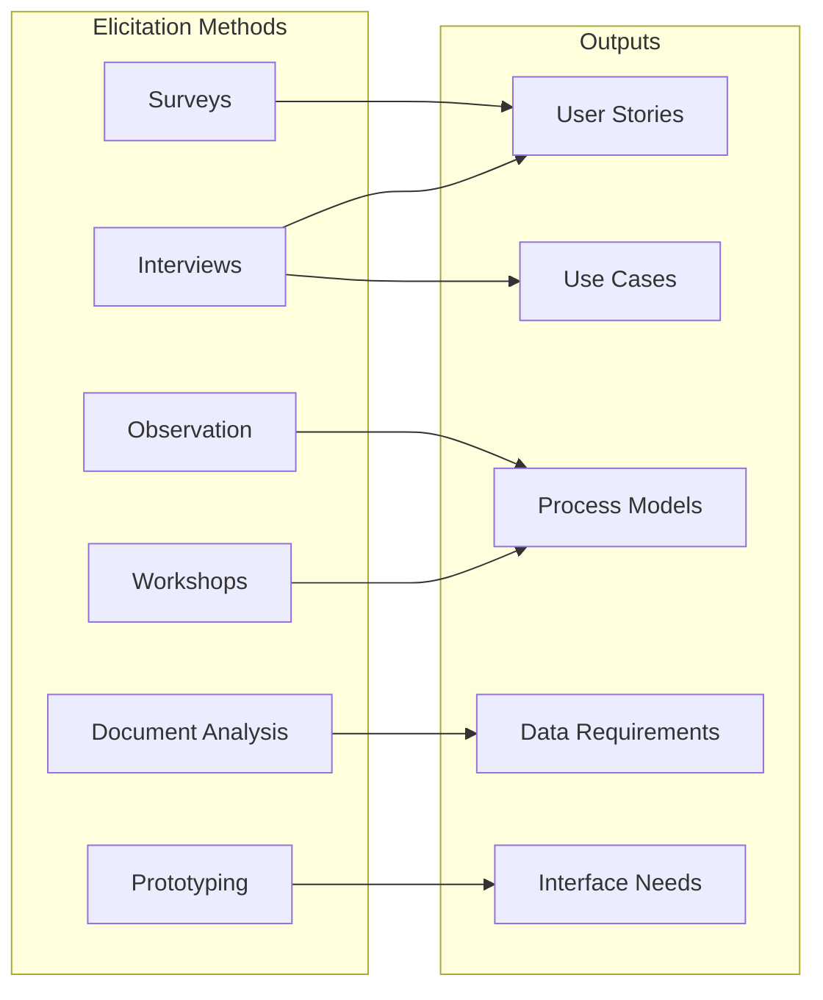
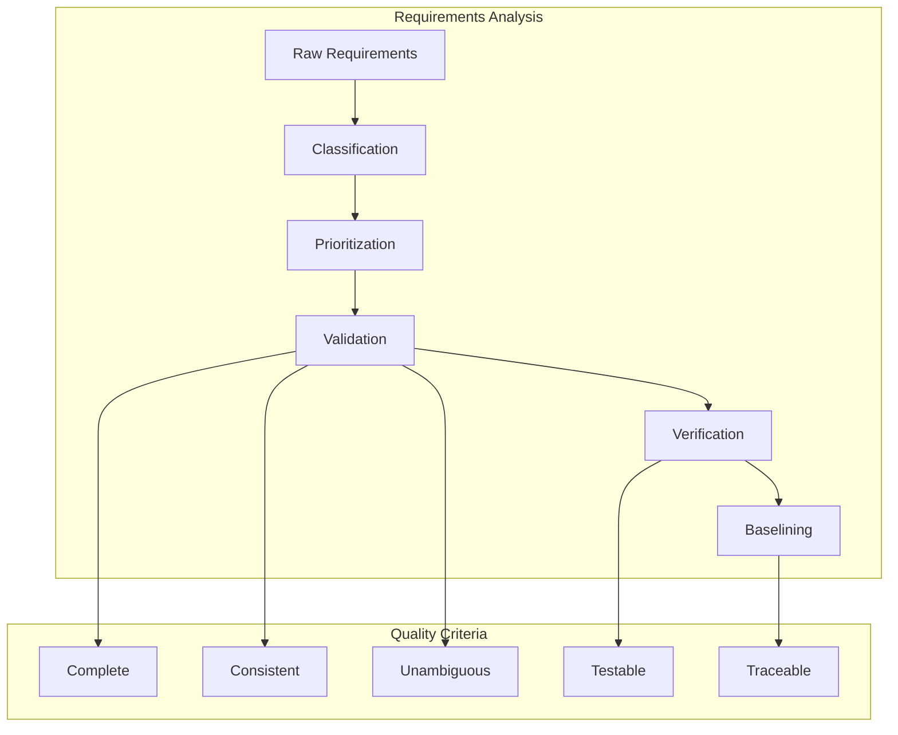
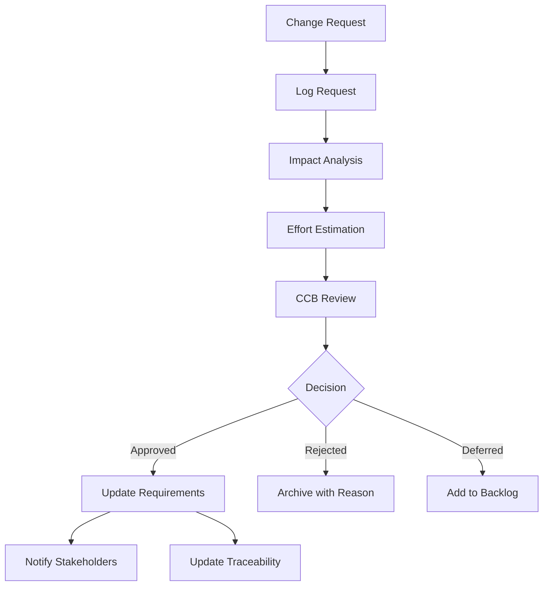

# ANNEX T4: REQUIREMENTS METHODOLOGY
## TSH-2607: Universal Service Provision (USP) Claims Management System (UCMS)
**Document Reference:** ANNEX-T04-REQ-METHODOLOGY-TSH2607.md  
**Version:** 1.0  
**Date:** January 2025  
**Classification:** Technical Annexure

---

## 1. INTRODUCTION

This annexure outlines the comprehensive requirements engineering methodology employed for the USP Claims Management System (UCMS) project. The methodology ensures complete traceability from business needs through to technical implementation.

**Cross-References:**
- URS: User Requirements Specification
- BRS: Business Requirements Specification
- SRS: System Requirements Specification
- SDS: System Design Specification

---

## 2. REQUIREMENTS HIERARCHY

### 2.1 Requirements Pyramid



### 2.2 Requirements Classification

| Level | Document | Primary Stakeholders | Focus Area |
|-------|----------|---------------------|------------|
| Business | BRS | Executives, Sponsors | Business objectives, ROI |
| User | URS | End Users, SMEs | User tasks, pain points |
| System | SRS | Architects, Analysts | Functional/Non-functional |
| Design | SDS | Developers, Designers | Technical implementation |
| Test | TCS | QA Team, Users | Acceptance criteria |

---

## 3. REQUIREMENTS ELICITATION PROCESS

### 3.1 Elicitation Techniques



### 3.2 Elicitation Schedule

| Phase | Activities | Duration | Participants |
|-------|------------|----------|--------------|
| **Discovery** | Stakeholder interviews, document review | Week 1-2 | Business Analysts, SMEs |
| **Workshop** | Requirements workshops, process mapping | Week 3-4 | Users, IT, Management |
| **Validation** | Prototype review, feedback sessions | Week 5-6 | End Users, Approvers |
| **Verification** | Requirements sign-off | Week 7 | All Stakeholders |

### 3.3 Stakeholder Engagement Matrix

| Stakeholder Group | Elicitation Method | Frequency | Responsibility |
|-------------------|-------------------|-----------|----------------|
| MCMC Management | Executive interviews | 2 sessions | Project Manager |
| Claims Officers | Workshops, observation | Weekly | Business Analyst |
| IT Team | Technical workshops | Bi-weekly | Solution Architect |
| External Users | Surveys, interviews | Once | Business Analyst |
| Audit/Compliance | Document review | As needed | Compliance Officer |

---

## 4. REQUIREMENTS ANALYSIS FRAMEWORK

### 4.1 Analysis Process



### 4.2 Requirements Prioritization Matrix

| Priority | MoSCoW | Description | Approval Authority |
|----------|--------|-------------|-------------------|
| P1 - Critical | Must Have | Essential for go-live | MCMC Director |
| P2 - High | Should Have | Important but not critical | Project Sponsor |
| P3 - Medium | Could Have | Desirable if resources permit | Project Manager |
| P4 - Low | Won't Have (Now) | Future enhancement | Product Owner |

### 4.3 Requirements Prioritization Criteria

| Criterion | Weight | Description |
|-----------|--------|-------------|
| Business Value | 30% | Contribution to strategic objectives |
| Regulatory Compliance | 25% | Legal/statutory requirement |
| User Impact | 20% | Number of users affected |
| Technical Complexity | 15% | Implementation difficulty |
| Risk Reduction | 10% | Mitigates project/operational risk |

---

## 5. REQUIREMENTS DOCUMENTATION STANDARDS

### 5.1 Requirement ID Convention

```
Format: [TYPE]-[MODULE]-[CATEGORY]-[NUMBER]

Examples:
- URS-CLM-FUNC-001    (User Req, Claims Module, Functional)
- SRS-ADM-TECH-042    (System Req, Admin Module, Technical)
- BRS-GEN-BIZ-003     (Business Req, General, Business)
```

### 5.2 Requirement Template

| Field | Description | Example |
|-------|-------------|---------|
| **ID** | Unique identifier | URS-CLM-FUNC-001 |
| **Title** | Short descriptive name | Claim Submission |
| **Description** | Detailed requirement | System shall allow registered users to submit claims... |
| **Priority** | MoSCoW classification | Must Have |
| **Source** | Origin of requirement | Stakeholder Workshop #3 |
| **Owner** | Responsible stakeholder | Claims Manager |
| **Rationale** | Business justification | Required by USP Guidelines 2024 |
| **Acceptance Criteria** | Testable conditions | AC1: User can complete submission in < 10 mins |
| **Dependencies** | Related requirements | URS-USR-FUNC-001 (User Registration) |
| **Status** | Current state | Approved |

### 5.3 Requirements Document Structure

```
1. Introduction
   1.1 Purpose
   1.2 Scope
   1.3 Definitions
   1.4 References

2. Overall Description
   2.1 System Context
   2.2 User Classes
   2.3 Operating Environment
   2.4 Constraints

3. Specific Requirements
   3.1 Functional Requirements
       3.1.1 [Module Name]
       3.1.2 [Module Name]
   3.2 Non-Functional Requirements
       3.2.1 Performance
       3.2.2 Security
       3.2.3 Usability
       3.2.4 Reliability

4. Interface Requirements
   4.1 User Interfaces
   4.2 Hardware Interfaces
   4.3 Software Interfaces
   4.4 Communication Interfaces

5. Appendices
   5.1 Traceability Matrix
   5.2 Data Dictionary
   5.3 Change Log
```

---

## 6. TRACEABILITY MANAGEMENT

### 6.1 Traceability Matrix Structure

| Req ID | Requirement | Source | Design Element | Code Module | Test Case | Status |
|--------|-------------|--------|----------------|-------------|-----------|--------|
| URS-001 | User login | Workshop | Login.java | AuthModule | TC-001 | Verified |
| URS-002 | Submit claim | Interview | ClaimCtrl | ClaimModule | TC-015 | In Progress |

### 6.2 Traceability Chain

```mermaid
graph LR
    BRS[BRS<br/>Business Req] --> URS[URS<br/>User Req]
    URS --> SRS[SRS<br/>System Req]
    SRS --> SDS[SDS<br/>Design]
    SDS --> CODE[Code<br/>Implementation]
    CODE --> UT[Unit Tests]
    UT --> IT[Integration Tests]
    IT --> UAT[User Acceptance]
    UAT --> PROD[Production]

    style BRS fill:#003366,color:#fff
    style URS fill:#0066CC,color:#fff
    style SRS fill:#28A745,color:#fff
    style SDS fill:#FFC107,color:#000
    style CODE fill:#17A2B8,color:#fff
    style UAT fill:#DC3545,color:#fff
```



### 6.3 Bidirectional Traceability

| Direction | Purpose | Method |
|-----------|---------|--------|
| Forward | Ensure all requirements are implemented | Req → Design → Code → Test |
| Backward | Identify impact of changes | Test → Code → Design → Req |
| Horizontal | Verify consistency across artifacts | Req ↔ Req, Design ↔ Design |

---

## 7. CHANGE MANAGEMENT PROCESS

### 7.1 Change Control Workflow



### 7.2 Change Control Board (CCB)

| Role | Responsibility | Authority |
|------|----------------|-----------|
| Chair (MCMC Rep) | Final decision on changes | Approve/Reject P1-P2 |
| Project Manager | Process facilitation | Approve P3-P4 |
| Technical Lead | Technical impact assessment | Recommend |
| Business Analyst | Requirements impact | Document |
| QA Lead | Testing impact | Assess |

### 7.3 Change Request Form

| Field | Description |
|-------|-------------|
| CR ID | CR-YYYY-NNN (e.g., CR-2025-001) |
| Date Submitted | Submission date |
| Requestor | Name and role |
| Related Req ID | Affected requirement(s) |
| Change Description | Detailed description |
| Business Justification | Why change is needed |
| Impact Assessment | Technical, schedule, cost |
| CCB Decision | Approved/Rejected/Deferred |
| Decision Date | Date of decision |
| Implementation Plan | How change will be implemented |

---

## 8. REQUIREMENTS VALIDATION & VERIFICATION

### 8.1 Validation Checklist

| Check | Criteria | Method |
|-------|----------|--------|
| Completeness | All user needs captured | Stakeholder review |
| Consistency | No conflicts between reqs | Traceability analysis |
| Correctness | Accurately reflects needs | Prototype review |
| Clarity | Unambiguous language | Peer review |
| Feasibility | Technically achievable | Technical assessment |
| Testability | Can be verified | Test case draft |

### 8.2 Verification Methods

| Method | Application | Participants |
|--------|-------------|--------------|
| **Reviews** | Document completeness | Analysts, SMEs |
| **Walkthroughs** | Process understanding | Users, Designers |
| **Inspections** | Defect identification | Technical team |
| **Prototyping** | UI/UX validation | End users |
| **Test Cases** | Verifiability check | QA Team |
| **Traceability** | Coverage analysis | BA, PM |

---

## 9. TOOLS & TEMPLATES

### 9.1 Requirements Management Tools

| Tool | Purpose | Usage |
|------|---------|-------|
| JIRA/Confluence | Requirements tracking | Primary RM tool |
| Visio/draw.io | Process modeling | Diagram creation |
| Oracle APEX | Prototyping | UI mockups |
| Excel | Traceability matrix | Analysis reports |
| Git | Version control | Document management |

### 9.2 Document Templates

1. Business Requirements Specification (BRS) Template
2. User Requirements Specification (URS) Template
3. System Requirements Specification (SRS) Template
4. Change Request Form Template
5. Traceability Matrix Template
6. Requirements Review Checklist

---

## 10. METRICS & REPORTING

### 10.1 Requirements Metrics

| Metric | Formula | Target |
|--------|---------|--------|
| Requirements Coverage | (Implemented Req / Total Req) × 100 | 100% |
| Defects per Requirement | Total Defects / Total Requirements | < 0.5 |
| Requirements Volatility | Changed Req / Total Req × 100 | < 10% |
| Traceability Completeness | Traced Req / Total Req × 100 | 100% |
| Stakeholder Satisfaction | Survey Score | > 4.0/5.0 |

### 10.2 Reporting Schedule

| Report | Frequency | Audience |
|--------|-----------|----------|
| Requirements Status | Weekly | Project Team |
| Traceability Matrix | Bi-weekly | QA, Technical Lead |
| Change Log | Monthly | Steering Committee |
| Metrics Dashboard | Monthly | Management |

---

## 11. DOCUMENT CONTROL

| Version | Date | Author | Changes |
|---------|------|--------|---------|
| 1.0 | January 2025 | Business Analysis Team | Initial version |

---

**END OF ANNEX T4**
