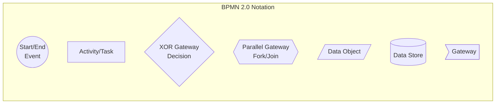
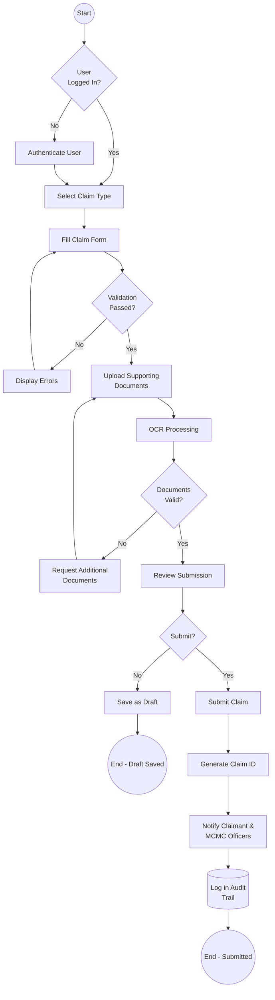
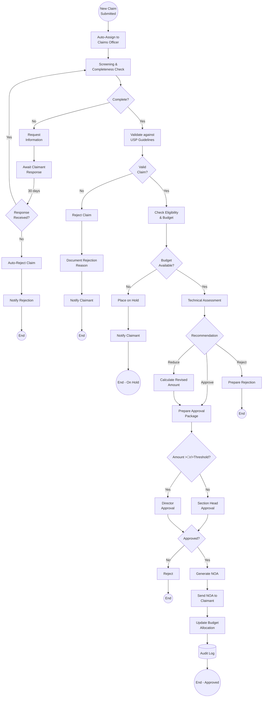
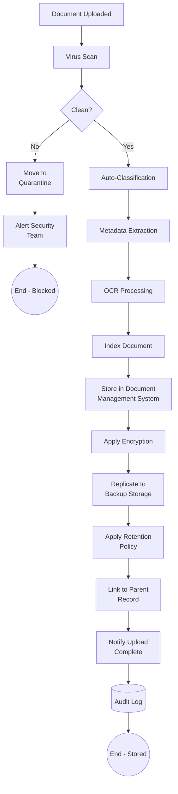
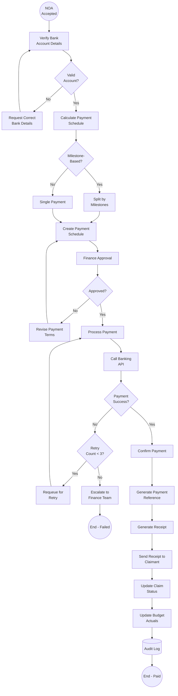
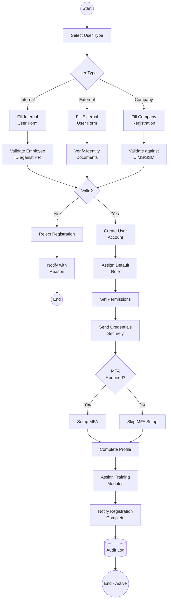
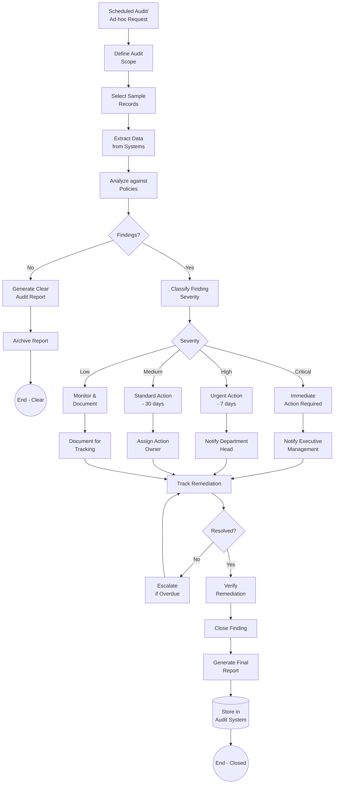
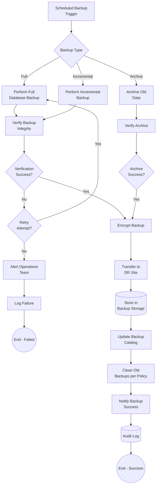
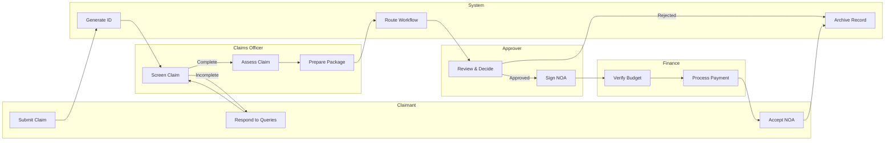

# ANNEX T5: SAMPLE PROCESS FLOWCHARTS (BPMN)
## TSH-2607: Universal Service Provision (USP) Claims Management System (UCMS)
**Document Reference:** ANNEX-T05-PROCESS-FLOWS-TSH2607.md  
**Version:** 1.0  
**Date:** January 2025  
**Classification:** Technical Annexure

---

## 1. INTRODUCTION

This annexure presents the Business Process Model and Notation (BPMN 2.0) flowcharts for key processes within the USP Claims Management System (UCMS). These diagrams illustrate the end-to-end workflows for claims management, user management, and system administration.

**Cross-References:**
- URS Section 6: Process Requirements
- BRS Section 5: Business Process Specifications
- SRS Section 9: Workflow Specifications
- SDS Section 7: Process Implementation

---

## 2. BPMN NOTATION LEGEND

| Symbol | Element | Description |
|--------|---------|-------------|
| Circle | Event | Start, intermediate, or end event |
| Rectangle | Activity | Task or subprocess |
| Diamond | Gateway | Decision or parallel processing |
| Document | Data Object | Information required/produced |
| Cylinder | Data Store | Database or persistent storage |
| Dashed Line | Message Flow | Communication between pools |
| Solid Line | Sequence Flow | Process flow direction |

---

## 3. CORE PROCESS FLOWS

### 3.1 Claim Submission Process (BPMN)

**Process Details:**

| Step | Actor | System Activity | Output |
|------|-------|-----------------|--------|
| 1 | Claimant | Access portal | Login screen |
| 2 | UCMS | Authenticate user | Session token |
| 3 | Claimant | Select claim category | Form loaded |
| 4 | UCMS | Validate form inputs | Validation results |
| 5 | Claimant | Upload documents | Document metadata |
| 6 | UCMS | OCR processing | Extracted text |
| 7 | UCMS | Validate documents | Validation report |
| 8 | Claimant | Confirm submission | Claim ID generated |
| 9 | UCMS | Send notifications | Email/SMS sent |

---

### 3.2 Claim Assessment & Approval Process

**Approval Matrix:**

| Claim Amount | First Approver | Second Approver | Final Authority |
|--------------|----------------|-----------------|-----------------|
| ≤ RM 50,000 | Claims Officer | Section Head | - |
| RM 50,001 - 200,000 | Section Head | Director | - |
| > RM 200,000 | Director | Deputy Chairman | Chairman |

---

### 3.3 Document Management Process

**Document Lifecycle:**

| Stage | Duration | Action |
|-------|----------|--------|
| Active | 7 years | Full access, regular backup |
| Archive | 3 years | Read-only, offline storage |
| Disposal | - | Secure deletion per policy |

---

### 3.4 Payment Processing Workflow

---

### 3.5 User Registration & Onboarding

**User Types & Roles:**

| User Type | Registration Flow | Approval Required | Default Role |
|-----------|-------------------|-------------------|--------------|
| Internal (MCMC) | Employee ID validation | Manager approval | Based on department |
| External (Industry) | Company + SSM validation | Admin approval | Claimant |
| Auditor | Special registration | Director approval | Read-Only Auditor |
| System Admin | Internal only | IT Director approval | Administrator |

---

### 3.6 Audit & Compliance Process

---

### 3.7 System Backup & Recovery

**Backup Schedule:**

| Backup Type | Frequency | Retention | Storage Location |
|-------------|-----------|-----------|------------------|
| Full Database | Weekly | 4 weeks | Primary + DR |
| Incremental | Daily | 14 days | Primary + DR |
| Transaction Log | Every 15 min | 48 hours | Primary + DR |
| Archive | Monthly | 7 years | Offsite Tape |
| Configuration | On change | 12 versions | Git + DR |

---

## 4. CROSS-FUNCTIONAL PROCESS MAP

### 4.1 End-to-End Claim Lifecycle

---

## 5. DOCUMENT CONTROL

| Version | Date | Author | Changes |
|---------|------|--------|---------|
| 1.0 | January 2025 | Process Modeling Team | Initial version |

---

**END OF ANNEX T5**
