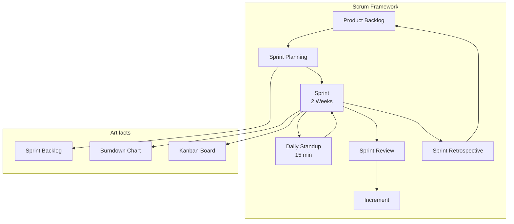
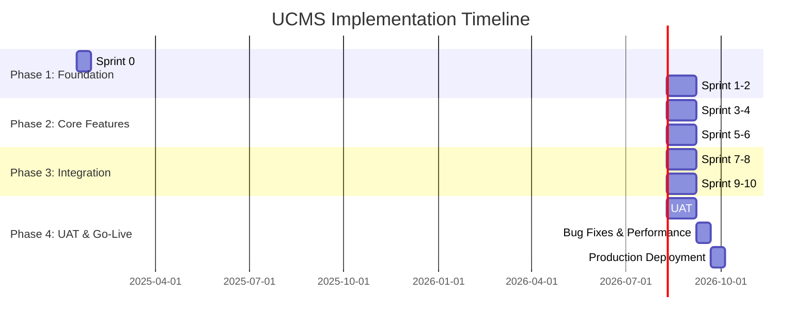
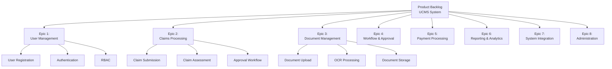
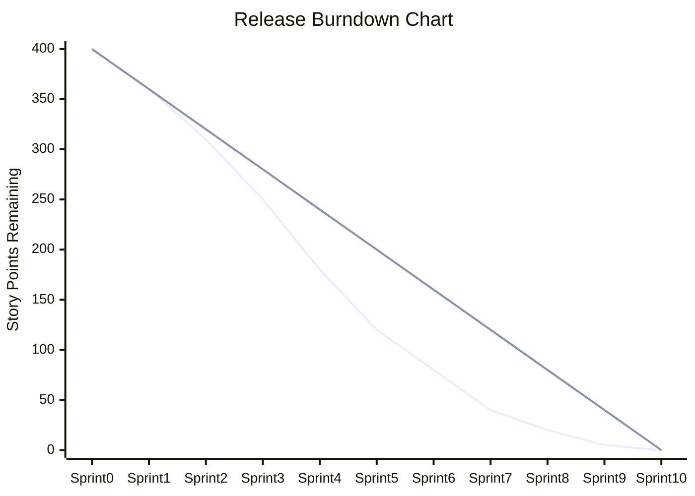
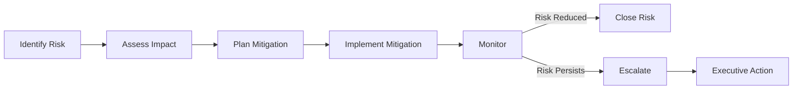

# ANNEX T8: AGILE PROJECT PLAN
## TSH-2607: Universal Service Provision (USP) Claims Management System (UCMS)
**Document Reference:** ANNEX-T08-AGILE-PLAN-TSH2607.md  
**Version:** 1.0  
**Date:** January 2025  
**Classification:** Technical Annexure

---

## 1. INTRODUCTION

This annexure presents the Agile project plan for the USP Claims Management System (UCMS) implementation. The plan adopts Scrum methodology with 2-week sprints, incorporating MCMC's governance requirements while maintaining Agile flexibility.

**Cross-References:**
- URS Section 3: Project Management Requirements
- BRS Section 7: Implementation Approach
- SRS Section 11: Development Methodology
- SDS Section 9: Project Planning

---

## 2. AGILE METHODOLOGY FRAMEWORK

### 2.1 Scrum Framework Overview



### 2.2 Agile Roles and Responsibilities

| Role | Resource Count | Responsibilities |
|------|----------------|------------------|
| **Product Owner** | 1 (MCMC) | Define priorities, accept/reject deliverables, stakeholder liaison |
| **Scrum Master** | 1 (Vendor) | Facilitate ceremonies, remove impediments, coach team |
| **Development Team** | 8-10 | Design, develop, test, deploy features |
| **Technical Lead** | 1 | Architecture decisions, code review, technical guidance |
| **Business Analyst** | 2 | Requirements elaboration, user story definition |
| **QA Engineer** | 2 | Test planning, automation, quality assurance |
| **DevOps Engineer** | 1 | CI/CD, environment management, deployment |

---

## 3. PROJECT PHASES & SPRINTS

### 3.1 Overall Project Timeline



### 3.2 Sprint Schedule

| Sprint | Duration | Focus Area | Key Deliverables |
|--------|----------|------------|------------------|
| **Sprint 0** | Week 1-2 | Setup & Architecture | Environments, CI/CD, Architecture baseline |
| **Sprint 1** | Week 3-4 | User Management | Authentication, RBAC, User profiles |
| **Sprint 2** | Week 5-6 | Master Data | Reference data, lookups, configurations |
| **Sprint 3** | Week 7-8 | Claims Registration | Claim submission, validation, document upload |
| **Sprint 4** | Week 9-10 | Document Management | OCR, document storage, versioning |
| **Sprint 5** | Week 11-12 | Workflow Engine | BPMN workflows, routing, notifications |
| **Sprint 6** | Week 13-14 | Assessment | Screening, assessment, approval workflow |
| **Sprint 7** | Week 15-16 | CIMS Integration | Company data sync, API integration |
| **Sprint 8** | Week 17-18 | Banking Integration | Payment processing, bank APIs |
| **Sprint 9** | Week 19-20 | Reporting | Dashboards, reports, analytics |
| **Sprint 10** | Week 21-22 | Advanced Features | RPA, advanced analytics, mobile |
| **Sprint 11** | Week 23-24 | UAT Support | Bug fixes, UAT support |
| **Sprint 12** | Week 25-26 | Stabilization | Performance tuning, security hardening |
| **Sprint 13** | Week 27-28 | Go-Live | Production deployment, hypercare |

### 3.3 Sprint Ceremonies Schedule

| Ceremony | Frequency | Duration | Participants |
|----------|-----------|----------|--------------|
| Sprint Planning | Sprint Start | 4 hours | Full team |
| Daily Standup | Daily | 15 minutes | Dev team, Scrum Master |
| Backlog Refinement | Twice per sprint | 2 hours | PO, BA, Tech Lead |
| Sprint Review | Sprint End | 2 hours | Full team + stakeholders |
| Sprint Retrospective | Sprint End | 1.5 hours | Full team |

---

## 4. PRODUCT BACKLOG STRUCTURE

### 4.1 Epic Breakdown



### 4.2 Sample Product Backlog

| ID | Epic | User Story | Priority | Story Points | Sprint Target |
|----|------|------------|----------|--------------|---------------|
| US-001 | User Management | As a claimant, I want to register so that I can submit claims | Must | 8 | Sprint 1 |
| US-002 | User Management | As an admin, I want to assign roles so that access is controlled | Must | 5 | Sprint 1 |
| US-003 | User Management | As a user, I want to reset my password so that I can regain access | Must | 3 | Sprint 1 |
| US-004 | Claims Processing | As a claimant, I want to submit a claim with attachments | Must | 13 | Sprint 3 |
| US-005 | Claims Processing | As an officer, I want to screen incoming claims | Must | 8 | Sprint 5 |
| US-006 | Document Management | As a system, I want to OCR uploaded documents | Should | 13 | Sprint 4 |
| US-007 | Workflow | As an approver, I want to receive notifications | Must | 5 | Sprint 5 |
| US-008 | Integration | As a system, I want to validate companies against CIMS | Must | 8 | Sprint 7 |

---

## 5. DEFINITION OF READY (DoR)

A user story is ready for sprint planning when:

| Criterion | Description | Verification |
|-----------|-------------|------------|
| **Independent** | Can be developed separately | No blocking dependencies |
| **Negotiable** | Details open for discussion | Team has reviewed |
| **Valuable** | Delivers business value | PO has confirmed value |
| **Estimable** | Can be sized by team | Story points assigned |
| **Small** | Fits in single sprint | ≤ 13 story points |
| **Testable** | Acceptance criteria clear | Test cases drafted |

### 5.1 User Story Template

```
Title: [Action] - [Object] - [Context]

As a [type of user],
I want [goal/desire],
So that [benefit/value].

Acceptance Criteria:
1. [Criteria 1 - Given/When/Then format]
2. [Criteria 2]
3. [Criteria 3]

Technical Notes:
- [Technical consideration 1]
- [Technical consideration 2]

UI/UX Reference:
- [Link to mockup or wireframe]

Dependencies:
- [List any dependencies]

Story Points: [X]
Priority: [Must/Should/Could/Won't]
```

---

## 6. DEFINITION OF DONE (DoD)

### 6.1 Universal DoD (All Stories)

| Checkpoint | Verification Method | Owner |
|------------|---------------------|-------|
| Code written and reviewed | Peer review completed | Developer |
| Unit tests written (≥80% coverage) | Coverage report | Developer |
| Integration tests pass | CI/CD pipeline green | QA |
| Code merged to develop branch | PR approved and merged | Tech Lead |
| Documentation updated | Wiki/docs updated | Developer |
| No critical/major bugs | Defect report | QA |
| Accepted by Product Owner | PO sign-off | Product Owner |

### 6.2 Feature-Specific DoD

| Feature Type | Additional Criteria |
|--------------|---------------------|
| **UI Feature** | Responsive design verified, accessibility tested, browser tested |
| **API Feature** | API documented, contract tests pass, rate limiting verified |
| **Database Change** | Migration script written, rollback tested, performance verified |
| **Integration** | Integration tests with external system, fallback tested |
| **Security Feature** | Security review passed, penetration tested |

---

## 7. SPRINT PLANNING TEMPLATE

### 7.1 Sprint Planning Agenda

| Time | Activity | Output |
|------|----------|--------|
| 0:00-0:30 | Review sprint goal | Committed goal statement |
| 0:30-1:30 | Story discussion & estimation | Refined acceptance criteria |
| 1:30-2:30 | Task breakdown | Tasks created in JIRA |
| 2:30-3:30 | Capacity planning | Team capacity calculated |
| 3:30-4:00 | Sprint commitment | Sprint backlog finalized |

### 7.2 Sprint Planning Template

```
================================================================================
SPRINT PLANNING - Sprint [Number]
Date: [Date]
Duration: [2 weeks]
================================================================================

SPRINT GOAL
-----------
[One-sentence description of sprint objective]

CAPACITY
--------
Team Members: [X]
Working Days: [Y]
Holidays/Vacation: [Z days]
Available Capacity: [X * Y - Z] person-days
Focus Factor: [80%]
Effective Capacity: [Calculated] person-days

COMMITTED STORIES
-----------------
| ID  | Story Title              | Points | Assignee | Tasks |
|-----|--------------------------|--------|----------|-------|
| US- | [Story description]      | [X]    | [Name]   | [Y]   |

Total Story Points: [Sum]

RISKS & DEPENDENCIES
--------------------
| Risk/Dependency | Mitigation | Owner |
|-----------------|------------|-------|
| [Description]   | [Action]   | [Name]|

COMMITMENT
----------
Team commits to delivering the above stories to meet the sprint goal.

Signed:
- Scrum Master: _________________ Date: _______
- Product Owner: ________________ Date: _______
```

---

## 8. BURNDOWN & VELOCITY TRACKING

### 8.1 Velocity Chart Template

| Sprint | Planned Points | Completed Points | Velocity | Notes |
|--------|----------------|------------------|----------|-------|
| Sprint 1 | 30 | 28 | 28 | Team ramp-up |
| Sprint 2 | 35 | 35 | 31.5 | Stable velocity |
| Sprint 3 | 40 | 38 | 33.6 | Adding complexity |
| Sprint 4 | 40 | 40 | 35.25 | Optimal flow |
| ... | ... | ... | ... | ... |

### 8.2 Release Burndown Projection



---

## 9. RISK MANAGEMENT IN AGILE

### 9.1 Risk Register

| ID | Risk | Probability | Impact | Mitigation Strategy | Owner |
|----|------|-------------|--------|---------------------|-------|
| R1 | CIMS integration delays | Medium | High | Early prototyping, mock services | Tech Lead |
| R2 | OCR accuracy issues | Medium | High | POC with sample documents, fallback | BA |
| R3 | Performance at scale | Low | High | Performance testing each sprint | QA |
| R4 | Requirements churn | Medium | Medium | Strict change control, grooming | PO |
| R5 | Resource availability | Low | Medium | Cross-training, knowledge docs | SM |

### 9.2 Risk Burndown



---

## 10. QUALITY GATES

### 10.1 Sprint Review Checklist

| Item | Criteria | Status |
|------|----------|--------|
| Demo prepared | All stories demo-able | ☐ |
| Stakeholders invited | Calendar invites sent | ☐ |
| Acceptance criteria met | PO verified | ☐ |
| Documentation updated | Wiki current | ☐ |
| Bugs reviewed | No critical open | ☐ |

### 10.2 Release Quality Gates

| Gate | Criteria | Sign-off |
|------|----------|----------|
| **Code Complete** | 100% stories done, code frozen | Tech Lead |
| **Test Complete** | ≥90% test coverage, all tests pass | QA Lead |
| **Security Review** | Pen test passed, vulnerabilities addressed | Security |
| **Performance** | Load testing meets NFRs | Performance Team |
| **UAT Complete** | UAT sign-off from MCMC | Product Owner |
| **Deployment Ready** | Deployment plan approved, rollback tested | DevOps |

---

## 11. DOCUMENT CONTROL

| Version | Date | Author | Changes |
|---------|------|--------|---------|
| 1.0 | January 2025 | Project Management Team | Initial version |

---

**END OF ANNEX T8**
