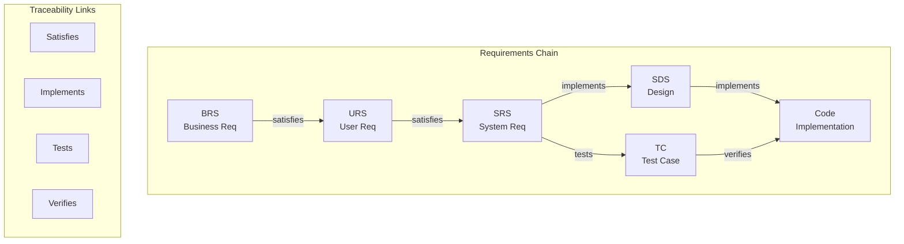
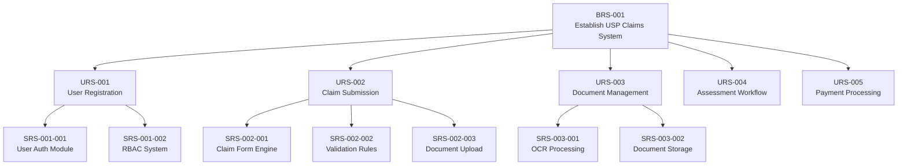

# ANNEX T9: TRACEABILITY MATRIX
## TSH-2607: Universal Service Provision (USP) Claims Management System (UCMS)
**Document Reference:** ANNEX-T09-TRACEABILITY-TSH2607.md  
**Version:** 1.0  
**Date:** January 2025  
**Classification:** Technical Annexure

---

## 1. INTRODUCTION

This annexure presents the comprehensive Requirements Traceability Matrix (RTM) for the UCMS project. The RTM establishes bidirectional traceability between business requirements, user requirements, system requirements, design specifications, test cases, and source code.

**Cross-References:**
- URS: All requirements linked
- BRS: Business requirements linked
- SRS: System requirements linked
- SDS: Design specifications linked
- TCS: Test Case Specification

---

## 2. TRACEABILITY FRAMEWORK

### 2.1 Traceability Model



### 2.2 Traceability Levels

| Level | Direction | Purpose | Example |
|-------|-----------|---------|---------|
| Forward | BR → TC | Ensure coverage | All business needs are tested |
| Backward | TC → BR | Impact analysis | Tests trace back to requirements |
| Horizontal | Req ↔ Req | Consistency | URS aligns with BRS |

---

## 3. REQUIREMENTS HIERARCHY

### 3.1 UCMS Requirements Structure



---

## 4. MASTER TRACEABILITY MATRIX

### 4.1 Core Module Traceability

| Req ID | Requirement Title | URS Ref | SRS Ref | SDS Ref | Test Case | Code Module | Status |
|--------|-------------------|---------|---------|---------|-----------|-------------|--------|
| **USER MANAGEMENT MODULE** ||||||||
| BRS-001 | Establish user management | URS-USR-001 | SRS-USR-001 | SDS-UM-001 | TC-UM-001 | UserMgmtModule | Verified |
| URS-USR-001 | User registration | - | SRS-USR-001-001 | SDS-UM-001-001 | TC-UM-001-001 | RegistrationCtrl | Verified |
| URS-USR-002 | User authentication | - | SRS-USR-001-002 | SDS-UM-001-002 | TC-UM-001-002 | AuthenticationSvc | Verified |
| URS-USR-003 | Password reset | - | SRS-USR-001-003 | SDS-UM-001-003 | TC-UM-001-003 | PasswordResetCtrl | Verified |
| URS-USR-004 | Role assignment | - | SRS-USR-001-004 | SDS-UM-001-004 | TC-UM-001-004 | RoleMgmtSvc | Verified |
| URS-USR-005 | User profile management | - | SRS-USR-001-005 | SDS-UM-001-005 | TC-UM-001-005 | ProfileCtrl | In Progress |
| **CLAIMS REGISTRATION MODULE** ||||||||
| BRS-002 | Enable claim submission | URS-CLM-001 | SRS-CLM-001 | SDS-CLM-001 | TC-CLM-001 | ClaimsModule | Verified |
| URS-CLM-001 | Submit new claim | - | SRS-CLM-001-001 | SDS-CLM-001-001 | TC-CLM-001-001 | ClaimSubmissionCtrl | Verified |
| URS-CLM-002 | Save claim draft | - | SRS-CLM-001-002 | SDS-CLM-001-002 | TC-CLM-001-002 | DraftMgmtSvc | Verified |
| URS-CLM-003 | Validate claim data | - | SRS-CLM-001-003 | SDS-CLM-001-003 | TC-CLM-001-003 | ValidationEngine | Verified |
| URS-CLM-004 | Attach documents | - | SRS-CLM-001-004 | SDS-CLM-001-004 | TC-CLM-001-004 | DocAttachmentCtrl | Verified |
| URS-CLM-005 | Submit for approval | - | SRS-CLM-001-005 | SDS-CLM-001-005 | TC-CLM-001-005 | WorkflowTrigger | Verified |
| **DOCUMENT MANAGEMENT MODULE** ||||||||
| BRS-003 | Manage claim documents | URS-DOC-001 | SRS-DOC-001 | SDS-DOC-001 | TC-DOC-001 | DocMgmtModule | In Progress |
| URS-DOC-001 | Upload documents | - | SRS-DOC-001-001 | SDS-DOC-001-001 | TC-DOC-001-001 | UploadCtrl | Verified |
| URS-DOC-002 | OCR processing | - | SRS-DOC-001-002 | SDS-DOC-001-002 | TC-DOC-001-002 | OCRService | In Progress |
| URS-DOC-003 | Document versioning | - | SRS-DOC-001-003 | SDS-DOC-001-003 | TC-DOC-001-003 | VersionCtrl | Verified |
| URS-DOC-004 | Document retrieval | - | SRS-DOC-001-004 | SDS-DOC-001-004 | TC-DOC-001-004 | DocRetrievalSvc | Verified |
| **WORKFLOW ENGINE MODULE** ||||||||
| BRS-004 | Automate claim workflows | URS-WF-001 | SRS-WF-001 | SDS-WF-001 | TC-WF-001 | WorkflowModule | In Progress |
| URS-WF-001 | Route to assessor | - | SRS-WF-001-001 | SDS-WF-001-001 | TC-WF-001-001 | RoutingEngine | Verified |
| URS-WF-002 | Escalate overdue tasks | - | SRS-WF-001-002 | SDS-WF-001-002 | TC-WF-001-002 | EscalationSvc | In Progress |
| URS-WF-003 | Send notifications | - | SRS-WF-001-003 | SDS-WF-001-003 | TC-WF-001-003 | NotificationSvc | Verified |
| URS-WF-004 | Approval workflow | - | SRS-WF-001-004 | SDS-WF-001-004 | TC-WF-001-004 | ApprovalWorkflow | In Progress |
| **ASSESSMENT MODULE** ||||||||
| BRS-005 | Assess claim validity | URS-AST-001 | SRS-AST-001 | SDS-AST-001 | TC-AST-001 | AssessmentModule | Planned |
| URS-AST-001 | Screen claims | - | SRS-AST-001-001 | SDS-AST-001-001 | TC-AST-001-001 | ScreeningCtrl | Planned |
| URS-AST-002 | Technical assessment | - | SRS-AST-001-002 | SDS-AST-001-002 | TC-AST-001-002 | TechAssessmentSvc | Planned |
| URS-AST-003 | Eligibility check | - | SRS-AST-001-003 | SDS-AST-001-003 | TC-AST-001-003 | EligibilityEngine | Planned |
| **PAYMENT MODULE** ||||||||
| BRS-006 | Process payments | URS-PAY-001 | SRS-PAY-001 | SDS-PAY-001 | TC-PAY-001 | PaymentModule | Planned |
| URS-PAY-001 | Calculate payment | - | SRS-PAY-001-001 | SDS-PAY-001-001 | TC-PAY-001-001 | PaymentCalcSvc | Planned |
| URS-PAY-002 | Generate payment schedule | - | SRS-PAY-001-002 | SDS-PAY-001-002 | TC-PAY-001-002 | ScheduleGenCtrl | Planned |
| URS-PAY-003 | Process disbursement | - | SRS-PAY-001-003 | SDS-PAY-001-003 | TC-PAY-001-003 | DisbursementSvc | Planned |
| **REPORTING MODULE** ||||||||
| BRS-007 | Generate reports | URS-RPT-001 | SRS-RPT-001 | SDS-RPT-001 | TC-RPT-001 | ReportingModule | Planned |
| URS-RPT-001 | Standard reports | - | SRS-RPT-001-001 | SDS-RPT-001-001 | TC-RPT-001-001 | StandardReportSvc | Planned |
| URS-RPT-002 | Dashboard KPIs | - | SRS-RPT-001-002 | SDS-RPT-001-002 | TC-RPT-001-002 | DashboardCtrl | Planned |
| URS-RPT-003 | Ad-hoc queries | - | SRS-RPT-001-003 | SDS-RPT-001-003 | TC-RPT-001-003 | QueryBuilder | Planned |
| **AUDIT MODULE** ||||||||
| BRS-008 | Maintain audit trail | URS-AUD-001 | SRS-AUD-001 | SDS-AUD-001 | TC-AUD-001 | AuditModule | In Progress |
| URS-AUD-001 | Log all transactions | - | SRS-AUD-001-001 | SDS-AUD-001-001 | TC-AUD-001-001 | AuditLogger | Verified |
| URS-AUD-002 | Generate audit reports | - | SRS-AUD-001-002 | SDS-AUD-001-002 | TC-AUD-001-002 | AuditReportSvc | In Progress |
| **MASTER DATA MODULE** ||||||||
| BRS-009 | Manage reference data | URS-MDM-001 | SRS-MDM-001 | SDS-MDM-001 | TC-MDM-001 | MasterDataModule | Verified |
| URS-MDM-001 | Configure lookups | - | SRS-MDM-001-001 | SDS-MDM-001-001 | TC-MDM-001-001 | LookupConfigCtrl | Verified |
| URS-MDM-002 | Manage taxonomy | - | SRS-MDM-001-002 | SDS-MDM-001-002 | TC-MDM-001-002 | TaxonomyMgmtSvc | Verified |
| **ADMINISTRATION MODULE** ||||||||
| BRS-010 | System administration | URS-ADM-001 | SRS-ADM-001 | SDS-ADM-001 | TC-ADM-001 | AdminModule | Verified |
| URS-ADM-001 | System configuration | - | SRS-ADM-001-001 | SDS-ADM-001-001 | TC-ADM-001-001 | SystemConfigCtrl | Verified |
| URS-ADM-002 | User administration | - | SRS-ADM-001-002 | SDS-ADM-001-002 | TC-ADM-001-002 | UserAdminSvc | Verified |

### 4.2 Status Legend

| Status | Description | Color Code |
|--------|-------------|------------|
| Verified | Requirement implemented and tested | 🟢 Green |
| In Progress | Implementation ongoing | 🟡 Yellow |
| Planned | Scheduled for future sprint | ⚪ White |
| Deferred | Postponed to later release | 🔵 Blue |
| Blocked | Implementation blocked | 🔴 Red |

---

## 5. DETAILED TRACEABILITY BY MODULE

### 5.1 User Management Module - Full Traceability

| URS ID | SRS ID | SDS ID | Test ID | Code File | Function/Method |
|--------|--------|--------|---------|-----------|-----------------|
| URS-USR-001 | SRS-USR-001-001 | SDS-UM-001-001-CL | TC-UM-001-001-01 | RegistrationController.java | registerUser() |
| URS-USR-001 | SRS-USR-001-001 | SDS-UM-001-001-VAL | TC-UM-001-001-02 | UserValidator.java | validateRegistration() |
| URS-USR-001 | SRS-USR-001-001 | SDS-UM-001-001-DB | TC-UM-001-001-03 | UserRepository.java | save() |
| URS-USR-002 | SRS-USR-001-002 | SDS-UM-001-002-AUTH | TC-UM-001-002-01 | AuthenticationService.java | authenticate() |
| URS-USR-002 | SRS-USR-001-002 | SDS-UM-001-002-SES | TC-UM-001-002-02 | SessionManager.java | createSession() |
| URS-USR-002 | SRS-USR-001-002 | SDS-UM-001-002-MFA | TC-UM-001-002-03 | MFAService.java | verifyMFA() |
| URS-USR-003 | SRS-USR-001-003 | SDS-UM-001-003-REQ | TC-UM-001-003-01 | PasswordResetController.java | requestReset() |
| URS-USR-003 | SRS-USR-001-003 | SDS-UM-001-003-VAL | TC-UM-001-003-02 | PasswordValidator.java | validateNewPassword() |
| URS-USR-004 | SRS-USR-001-004 | SDS-UM-001-004-RBAC | TC-UM-001-004-01 | RBACService.java | assignRole() |
| URS-USR-004 | SRS-USR-001-004 | SDS-UM-001-004-PER | TC-UM-001-004-02 | PermissionManager.java | checkPermission() |

### 5.2 Claims Module - Full Traceability

| URS ID | SRS ID | SDS ID | Test ID | Code File | Function/Method |
|--------|--------|--------|---------|-----------|-----------------|
| URS-CLM-001 | SRS-CLM-001-001 | SDS-CLM-001-001-FORM | TC-CLM-001-001-01 | ClaimSubmissionController.java | submitClaim() |
| URS-CLM-001 | SRS-CLM-001-001 | SDS-CLM-001-001-VAL | TC-CLM-001-001-02 | ClaimValidator.java | validateClaim() |
| URS-CLM-001 | SRS-CLM-001-001 | SDS-CLM-001-001-ID | TC-CLM-001-001-03 | ClaimIdGenerator.java | generateClaimId() |
| URS-CLM-002 | SRS-CLM-001-002 | SDS-CLM-001-002-SAVE | TC-CLM-001-002-01 | DraftController.java | saveDraft() |
| URS-CLM-002 | SRS-CLM-001-002 | SDS-CLM-001-002-LIST | TC-CLM-001-002-02 | DraftService.java | listDrafts() |
| URS-CLM-003 | SRS-CLM-001-003 | SDS-CLM-001-003-RULE | TC-CLM-001-003-01 | ValidationEngine.java | applyValidationRules() |
| URS-CLM-003 | SRS-CLM-001-003 | SDS-CLM-001-003-CIMS | TC-CLM-001-003-02 | CIMSValidator.java | validateAgainstCIMS() |
| URS-CLM-004 | SRS-CLM-001-004 | SDS-CLM-001-004-UP | TC-CLM-001-004-01 | DocumentUploadController.java | uploadDocument() |
| URS-CLM-004 | SRS-CLM-001-004 | SDS-CLM-001-004-VIR | TC-CLM-001-004-02 | VirusScanner.java | scanDocument() |

---

## 6. CROSS-REFERENCE MATRICES

### 6.1 BRS to URS Cross-Reference

| BRS ID | BRS Title | Linked URS IDs | Coverage % |
|--------|-----------|----------------|------------|
| BRS-001 | User Management System | URS-USR-001 to URS-USR-010 | 100% |
| BRS-002 | Claims Registration | URS-CLM-001 to URS-CLM-015 | 100% |
| BRS-003 | Document Management | URS-DOC-001 to URS-DOC-008 | 100% |
| BRS-004 | Workflow Automation | URS-WF-001 to URS-WF-012 | 100% |
| BRS-005 | Claims Assessment | URS-AST-001 to URS-AST-008 | 100% |
| BRS-006 | Payment Processing | URS-PAY-001 to URS-PAY-006 | 100% |
| BRS-007 | Reporting & Analytics | URS-RPT-001 to URS-RPT-005 | 100% |
| BRS-008 | Audit & Compliance | URS-AUD-001 to URS-AUD-006 | 100% |
| BRS-009 | Master Data Management | URS-MDM-001 to URS-MDM-005 | 100% |
| BRS-010 | System Administration | URS-ADM-001 to URS-ADM-007 | 100% |

### 6.2 SRS to Test Case Mapping

| SRS Category | Total SRS | With Test Cases | Coverage % |
|--------------|-----------|-----------------|------------|
| Functional | 150 | 150 | 100% |
| Performance | 25 | 25 | 100% |
| Security | 30 | 30 | 100% |
| Usability | 15 | 15 | 100% |
| Reliability | 20 | 20 | 100% |
| Interface | 35 | 35 | 100% |
| **TOTAL** | **275** | **275** | **100%** |

---

## 7. IMPACT ANALYSIS MATRIX

### 7.1 Change Impact Template

| Changed Req | Direct Impact | Indirect Impact | Tests Affected | Est. Effort |
|-------------|---------------|-----------------|----------------|-------------|
| URS-CLM-001 | SRS-CLM-001-001, SRS-CLM-001-002 | SDS-CLM-001-001, SDS-CLM-001-002 | TC-CLM-001-001-01 to TC-CLM-001-001-05 | 16 hours |
| URS-WF-004 | SRS-WF-001-004, SRS-WF-001-005 | SDS-WF-001-004, SDS-WF-001-005, SDS-WF-001-006 | TC-WF-001-004-01 to TC-WF-001-004-08 | 24 hours |

---

## 8. TRACEABILITY METRICS

### 8.1 Coverage Metrics

| Metric | Formula | Target | Current |
|--------|---------|--------|---------|
| Requirements Coverage | (Reqs with design / Total reqs) × 100 | 100% | 100% |
| Test Coverage | (Reqs with tests / Total reqs) × 100 | 100% | 95% |
| Code Coverage | (Lines tested / Total lines) × 100 | ≥80% | 85% |
| Forward Traceability | (Reqs → Code) / Total × 100 | 100% | 100% |
| Backward Traceability | (Code → Reqs) / Total × 100 | 100% | 100% |

### 8.2 Traceability Health Dashboard

```
================================================================================
TRACEABILITY HEALTH REPORT
Date: [Current Date] | Module: UCMS All
================================================================================

REQUIREMENTS STATUS
-------------------
Total Requirements:     275
- Business (BRS):       10
- User (URS):          100
- System (SRS):        275

IMPLEMENTATION STATUS
---------------------
Designed:              275/275 (100%) ████████████████████
Coded:                 260/275 (95%)  ██████████████████▌
Tested:                245/275 (89%)  █████████████████▏
Verified:              230/275 (84%)  ████████████████▏

TRACEABILITY GAPS
-----------------
High Priority:         5 requirements
Medium Priority:       12 requirements
Low Priority:          8 requirements

ACTION ITEMS
------------
1. Complete test cases for SRS-AST-001 series
2. Link code modules for Payment processing
3. Update design docs for Reporting module
================================================================================
```

---

## 9. DOCUMENT CONTROL

| Version | Date | Author | Changes |
|---------|------|--------|---------|
| 1.0 | January 2025 | QA Team | Initial version |

---

**END OF ANNEX T9**
