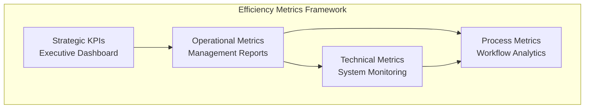
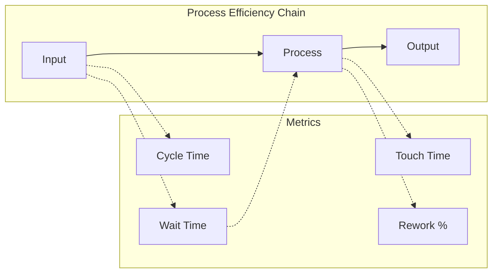
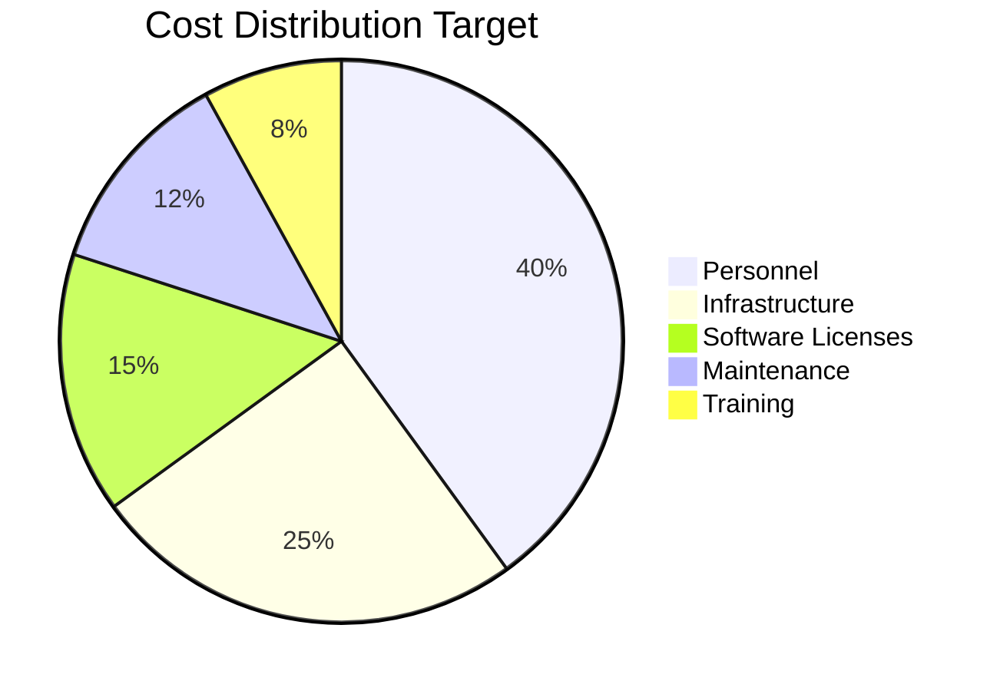
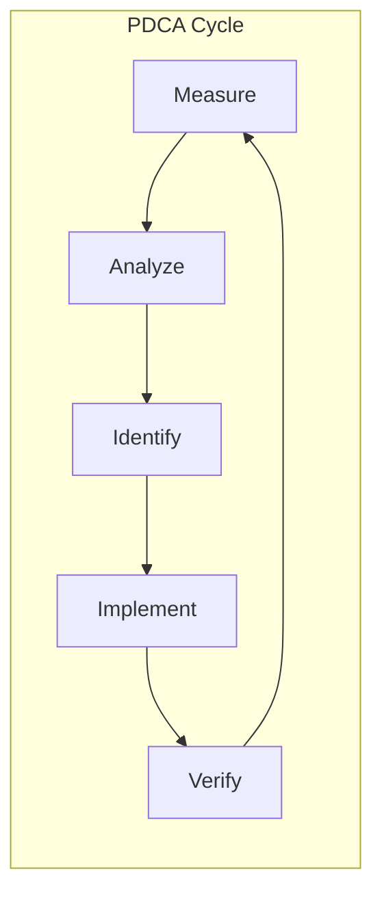

# ANNEX T10: EFFICIENCY METRICS
## TSH-2607: Universal Service Provision (USP) Claims Management System (UCMS)
**Document Reference:** ANNEX-T10-EFFICIENCY-TSH2607.md  
**Version:** 1.0  
**Date:** January 2025  
**Classification:** Technical Annexure

---

## 1. INTRODUCTION

This annexure defines the efficiency metrics, Key Performance Indicators (KPIs), and measurement frameworks for the USP Claims Management System (UCMS). These metrics ensure the system delivers measurable improvements in operational efficiency and service delivery.

**Cross-References:**
- URS Section 8: Performance Requirements
- BRS Section 8: Efficiency Goals
- SRS Section 12: Performance Specifications
- SDS Section 10: Performance Optimization

---

## 2. EFFICIENCY MEASUREMENT FRAMEWORK

### 2.1 Metrics Hierarchy



### 2.2 Measurement Dimensions

| Dimension | Focus Area | Measurement Frequency | Audience |
|-----------|------------|----------------------|----------|
| **Time** | Speed of processing | Real-time / Hourly | Operations |
| **Cost** | Resource utilization | Daily / Weekly | Management |
| **Quality** | Accuracy & compliance | Per transaction | QA / Audit |
| **Productivity** | Throughput & capacity | Hourly / Daily | Operations |
| **Satisfaction** | User experience | Per interaction | All |

---

## 3. STRATEGIC KPIs

### 3.1 Executive Dashboard Metrics

| KPI ID | KPI Name | Definition | Target | Measurement |
|--------|----------|------------|--------|-------------|
| KPI-001 | Claim Processing Time | Average end-to-end claim processing duration | < 30 days | Days per claim |
| KPI-002 | System Availability | % of time system is operational | ≥ 99.9% | Monthly uptime |
| KPI-003 | Digital Adoption Rate | % of claims submitted online | ≥ 95% | Monthly ratio |
| KPI-004 | Cost per Claim | Total operating cost / claims processed | < RM 500 | RM per claim |
| KPI-005 | User Satisfaction | Average user satisfaction score | ≥ 4.2/5.0 | Quarterly survey |

### 3.2 Baseline vs Target Comparison

```mermaid
xychart-beta
    title "Efficiency Improvement Targets"
    x-axis [Processing Time, Availability, Digital %, Cost, Satisfaction]
    y-axis "Score / Value" 0 --> 100
    bar [60, 98, 45, 40, 75]
    bar [90, 99.9, 95, 80, 85]
    
    Current "Current State"
    Target "Target State"
```

---

## 4. OPERATIONAL METRICS

### 4.1 Claims Processing Metrics

| Metric ID | Metric Name | Formula | Target | Alert Threshold |
|-----------|-------------|---------|--------|-----------------|
| OPM-001 | Submission to Registration | Time from submission to claim ID | < 1 hour | > 4 hours |
| OPM-002 | Registration to Screening | Time from ID to screening start | < 24 hours | > 48 hours |
| OPM-003 | Screening to Assessment | Time from screening to assessment | < 3 days | > 5 days |
| OPM-004 | Assessment to Decision | Time from assessment to approval | < 5 days | > 10 days |
| OPM-005 | Approval to Payment | Time from NOA to disbursement | < 14 days | > 21 days |
| OPM-006 | Total Cycle Time | Sum of all processing stages | < 30 days | > 45 days |

### 4.2 Throughput Metrics

| Metric ID | Metric Name | Formula | Target | Peak Capacity |
|-----------|-------------|---------|--------|---------------|
| THP-001 | Claims per Day | Total claims / working days | 50/day | 100/day |
| THP-002 | Documents per Hour | Documents processed / hour | 200/hour | 500/hour |
| THP-003 | Payments per Day | Payments processed / day | 30/day | 60/day |
| THP-004 | Concurrent Users | Simultaneous active users | 500 | 2000 |
| THP-005 | API Calls per Minute | Total API requests / minute | 1000/min | 5000/min |

---

## 5. TECHNICAL PERFORMANCE METRICS

### 5.1 System Performance

| Metric ID | Metric Name | Definition | Target | Critical |
|-----------|-------------|------------|--------|----------|
| TEC-001 | Page Load Time | Time to fully render page | < 3 sec | > 5 sec |
| TEC-002 | API Response Time | Server response time | < 500ms | > 2 sec |
| TEC-003 | Database Query Time | SQL execution time | < 100ms | > 500ms |
| TEC-004 | Report Generation | Complex report time | < 30 sec | > 2 min |
| TEC-005 | Login Time | Authentication duration | < 2 sec | > 5 sec |
| TEC-006 | Search Response | Search results time | < 2 sec | > 5 sec |

### 5.2 Infrastructure Metrics

| Metric ID | Metric Name | Unit | Target | Scale Threshold |
|-----------|-------------|------|--------|-----------------|
| INF-001 | CPU Utilization | % | < 70% | > 85% |
| INF-002 | Memory Utilization | % | < 80% | > 90% |
| INF-003 | Disk I/O | IOPS | < 5000 | > 8000 |
| INF-004 | Network Latency | ms | < 50ms | > 100ms |
| INF-005 | Connection Pool | % used | < 80% | > 95% |
| INF-006 | Error Rate | % | < 0.1% | > 1% |

---

## 6. PROCESS EFFICIENCY METRICS

### 6.1 Workflow Efficiency



| Metric ID | Metric Name | Formula | Target | Industry Benchmark |
|-----------|-------------|---------|--------|-------------------|
| PRC-001 | First-Time-Right Rate | (No rework / Total) × 100 | > 85% | 75% |
| PRC-002 | Automation Rate | (Automated steps / Total) × 100 | > 80% | 60% |
| PRC-003 | Touch Time Ratio | Touch time / Cycle time | > 30% | 25% |
| PRC-004 | Rework Rate | (Reworked claims / Total) × 100 | < 5% | 10% |
| PRC-005 | Straight-Through Processing | Auto-approved / Total | > 40% | 30% |

### 6.2 Resource Utilization

| Metric ID | Metric Name | Formula | Target | Measurement |
|-----------|-------------|---------|--------|-------------|
| RES-001 | Claims Officer Utilization | Active time / Available time | 75-85% | Weekly |
| RES-002 | Assessor Case Load | Cases per assessor | 15-20 | Daily |
| RES-003 | System Capacity Usage | Current load / Max capacity | < 70% | Real-time |
| RES-004 | OCR Accuracy | Correct extractions / Total | > 95% | Per batch |
| RES-005 | API Success Rate | Successful calls / Total | > 99% | Per minute |

---

## 7. QUALITY METRICS

### 7.1 Accuracy Metrics

| Metric ID | Metric Name | Definition | Target | Measurement |
|-----------|-------------|------------|--------|-------------|
| QUA-001 | Data Entry Accuracy | Correct entries / Total entries | > 99% | Per form |
| QUA-002 | OCR Extraction Accuracy | Correct fields / Total fields | > 95% | Per document |
| QUA-003 | Calculation Accuracy | Correct calculations / Total | 100% | Per claim |
| QUA-004 | Routing Accuracy | Correct assignments / Total | > 98% | Per task |
| QUA-005 | Document Classification | Correctly classified / Total | > 95% | Per upload |

### 7.2 Compliance Metrics

| Metric ID | Metric Name | Definition | Target | Measurement |
|-----------|-------------|------------|--------|-------------|
| COM-001 | SLA Compliance | Tasks within SLA / Total | > 95% | Weekly |
| COM-002 | Audit Findings | Issues per audit | < 2 | Per audit |
| COM-003 | Security Incidents | Unauthorized access events | 0 | Monthly |
| COM-004 | Data Privacy Breaches | PII exposure incidents | 0 | Monthly |
| COM-005 | Regulatory Compliance | Requirements met / Total | 100% | Quarterly |

---

## 8. USER EXPERIENCE METRICS

### 8.1 Usability Metrics

| Metric ID | Metric Name | Measurement Method | Target | Frequency |
|-----------|-------------|-------------------|--------|-----------|
| UX-001 | Task Completion Rate | Completed / Started | > 90% | Daily |
| UX-002 | Error Rate | Errors per session | < 2 | Per session |
| UX-003 | Time on Task | Average time to complete | < Baseline | Per task |
| UX-004 | Help Requests | Support tickets per user | < 0.5 | Monthly |
| UX-005 | Abandonment Rate | Abandoned / Started | < 10% | Per process |

### 8.2 User Satisfaction Survey

| Question | Scale | Target | Weight |
|----------|-------|--------|--------|
| How satisfied are you with the system? | 1-5 | ≥ 4.0 | 25% |
| How easy is it to submit a claim? | 1-5 | ≥ 4.2 | 20% |
| How would you rate system speed? | 1-5 | ≥ 4.0 | 15% |
| How helpful are the notifications? | 1-5 | ≥ 3.8 | 15% |
| Would you recommend this system? | 0-10 | ≥ 8 | 25% |

**Net Promoter Score (NPS) Target: ≥ 50**

---

## 9. COST EFFICIENCY METRICS

### 9.1 Cost Analysis

| Metric ID | Metric Name | Formula | Target | Baseline |
|-----------|-------------|---------|--------|----------|
| CST-001 | Cost per Transaction | Total cost / Transactions | < RM 50 | RM 75 |
| CST-002 | Cost per Claim | Total cost / Claims processed | < RM 500 | RM 800 |
| CST-003 | IT Cost Ratio | IT costs / Total operating costs | < 25% | 30% |
| CST-004 | Automation Savings | (Manual cost - Automated cost) | > 40% | - |
| CST-005 | ROI | (Benefits - Costs) / Costs | > 150% | - |

### 9.2 Resource Cost Breakdown



---

## 10. MEASUREMENT & REPORTING

### 10.1 Reporting Schedule

| Report | Frequency | Audience | Metrics Included |
|--------|-----------|----------|------------------|
| Executive Dashboard | Real-time | C-level | KPI-001 to KPI-005 |
| Operations Report | Daily | Operations Manager | OPM-001 to OPM-006 |
| Performance Report | Weekly | IT Manager | TEC-001 to TEC-006 |
| Quality Report | Weekly | QA Manager | QUA-001 to QUA-005 |
| Monthly Review | Monthly | Steering Committee | All strategic KPIs |
| Annual Report | Annually | Board | Comprehensive analysis |

### 10.2 Dashboard Layout

```
+------------------------------------------------------------------+
|                    UCMS EFFICIENCY DASHBOARD                     |
+------------------------------------------------------------------+
|  [Date Range: __________]  [Refresh]  [Export]  [Settings]       |
+------------------------------------------------------------------+
|                                                                  |
|  +----------------+  +----------------+  +----------------+     |
|  | PROCESSING TIME|  | AVAILABILITY   |  | DIGITAL RATE   |     |
|  |                |  |                |  |                |     |
|  |   24 days      |  |   99.95%       |  |   97.5%        |     |
|  |   ▼ 6 days     |  |   ▲ 0.05%      |  |   ▲ 12.5%      |     |
|  +----------------+  +----------------+  +----------------+     |
|                                                                  |
|  +------------------------------+  +------------------------+   |
|  | CLAIMS PROCESSING PIPELINE   |  | PERFORMANCE TRENDS     |   |
|  |                              |  |                        |   |
|  | [Visual Pipeline Chart]      |  | [Line Graph]           |   |
|  |                              |  |                        |   |
|  | Pending: 45  In Progress: 32 |  | Response Time Trend    |   |
|  | Approved: 12  Paid: 8        |  | Over 30 Days           |   |
|  +------------------------------+  +------------------------+   |
|                                                                  |
|  +------------------------------+  +------------------------+   |
|  | SLA COMPLIANCE BY STAGE      |  | TOP BOTTLENECKS        |   |
|  |                              |  |                        |   |
|  | Screening: 98% ████████▌     |  | 1. Document Review     |   |
|  | Assessment: 95% ████████▋    |  | 2. External Validation |   |
|  | Approval: 92% ████████▊      |  | 3. Payment Processing  |   |
|  | Payment: 96% ████████▋       |  |                        |   |
|  +------------------------------+  +------------------------+   |
|                                                                  |
+------------------------------------------------------------------+
```

---

## 11. CONTINUOUS IMPROVEMENT

### 11.1 Improvement Framework



### 11.2 Target Review Cycle

| Metric Category | Review Frequency | Adjustment Authority |
|-----------------|------------------|---------------------|
| Strategic KPIs | Quarterly | Steering Committee |
| Operational Metrics | Monthly | Operations Manager |
| Technical Metrics | Weekly | IT Manager |
| Quality Metrics | Per release | QA Manager |

---

## 12. DOCUMENT CONTROL

| Version | Date | Author | Changes |
|---------|------|--------|---------|
| 1.0 | January 2025 | Performance Team | Initial version |

---

**END OF ANNEX T10**
