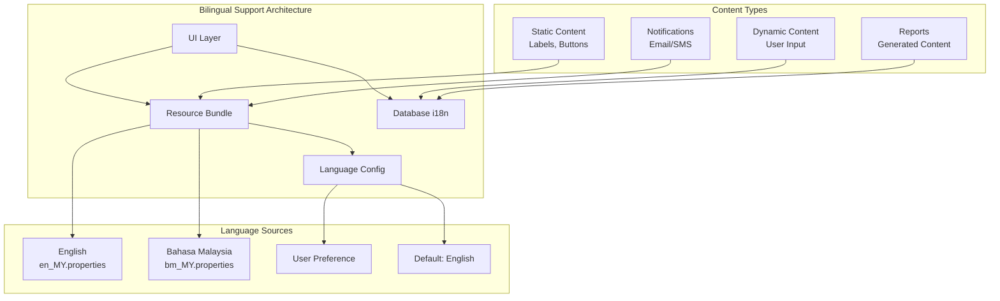

# ANNEX T11: BILINGUAL INTERFACE SAMPLES
## TSH-2607: Universal Service Provision (USP) Claims Management System (UCMS)
**Document Reference:** ANNEX-T11-BILINGUAL-TSH2607.md  
**Version:** 1.0  
**Date:** January 2025  
**Classification:** Technical Annexure

---

## 1. INTRODUCTION

This annexure presents the bilingual interface design specifications and sample screens for the USP Claims Management System (UCMS). The system provides full support for both English and Bahasa Malaysia (BM) as required by MCMC's multilingual policy.

**Cross-References:**
- URS Section 5.4: Language Requirements
- BRS Section 4.3: Localization Specifications
- SRS Section 8.5: Internationalization Standards
- SDS Section 6.4: Bilingual Implementation

---

## 2. BILINGUAL DESIGN FRAMEWORK

### 2.1 Language Architecture



### 2.2 Language Configuration

| Component | Implementation | Fallback |
|-----------|----------------|----------|
| UI Labels | Java Resource Bundles | English |
| Database Content | i18n tables | English |
| Error Messages | Message properties | English |
| Reports | Template-based i18n | English |
| Emails | Template + Resource | English |
| Date/Time | Java Locale | System default |
| Currency | Number format locale | MYR format |

---

## 3. INTERFACE TRANSLATION MATRIX

### 3.1 Navigation & Menu Translations

| English | Bahasa Malaysia | Context | Icon |
|---------|-----------------|---------|------|
| Dashboard | Papan Pemuka | Main menu | 🏠 |
| Submit Claim | Hantar Tuntutan | Primary action | 📝 |
| My Claims | Tuntutan Saya | User menu | 📋 |
| Documents | Dokumen | Document section | 📄 |
| Reports | Laporan | Analytics | 📊 |
| User Management | Pengurusan Pengguna | Admin menu | 👥 |
| Settings | Tetapan | Configuration | ⚙️ |
| Help | Bantuan | Support | ❓ |
| Logout | Log Keluar | Session | 🚪 |

### 3.2 Common Action Buttons

| English | Bahasa Malaysia | Button Style |
|---------|-----------------|--------------|
| Submit | Hantar | Primary (Blue) |
| Save | Simpan | Secondary (Grey) |
| Cancel | Batal | Outline |
| Edit | Sunting | Icon + Text |
| Delete | Padam | Danger (Red) |
| Search | Cari | Icon + Text |
| Filter | Tapis | Icon + Text |
| Export | Eksport | Icon + Text |
| Print | Cetak | Icon + Text |
| Download | Muat Turun | Icon + Text |
| Upload | Muat Naik | Icon + Text |
| Approve | Lulus | Success (Green) |
| Reject | Tolak | Danger (Red) |
| Request Info | Mohon Maklumat | Warning (Yellow) |
| Back | Kembali | Link style |
| Next | Seterusnya | Primary |
| Previous | Sebelumnya | Secondary |

### 3.3 Status Indicators

| English | Bahasa Malaysia | Color Code |
|---------|-----------------|------------|
| Pending | Tertunggu | 🟡 Yellow |
| In Progress | Dalam Proses | 🔵 Blue |
| Under Review | Dalam Semakan | 🟠 Orange |
| Approved | Diluluskan | 🟢 Green |
| Rejected | Ditolak | 🔴 Red |
| Paid | Dibayar | 💰 Green |
| On Hold | Ditangguh | ⏸️ Grey |
| Cancelled | Dibatalkan | ❌ Grey |
| Draft | Draf | 📝 Grey |
| Completed | Selesai | ✅ Green |

---

## 4. SCREEN SAMPLES - BILINGUAL

### 4.1 Login Screen (Bilingual)

```
+------------------------------------------------------------------+
|                    [MCMC LOGO]                                   |
|                                                                  |
|    ╔══════════════════════════════════════════════════════╗      |
|    ║                                                      ║      |
|    ║        SELAMAT DATANG  |  WELCOME                    ║      |
|    ║                                                      ║      |
|    ║   [👤] Nama Pengguna / Username                      ║      |
|    ║   +------------------------------------------------+ ║      |
|    ║   |                                                | ║      |
|    ║   +------------------------------------------------+ ║      |
|    ║                                                      ║      |
|    ║   [🔒] Kata Laluan / Password                        ║      |
|    ║   +------------------------------------------------+ ║      |
|    ║   |                                                | ║      |
|    ║   +------------------------------------------------+ ║      |
|    ║                                                      ║      |
|    ║   [ ] Tunjuk / Show                                  ║      |
|    ║                                                      ║      |
|    ║   [ 🌐 English / Bahasa Malaysia ▼ ]                 ║      |
|    ║                                                      ║      |
|    ║   +------------------------------------------------+ ║      |
|    ║   |            LOG MASUK / LOGIN                     | ║      |
|    ║   +------------------------------------------------+ ║      |
|    ║                                                      ║      |
|    ║   [Terlupa Kata Laluan? / Forgot Password?]          ║      |
|    ║   [Daftar / Register]                                ║      |
|    ║                                                      ║      |
|    ╚══════════════════════════════════════════════════════╝      |
|                                                                  |
|    [Dasar Privasi / Privacy Policy]  [Bantuan / Help]            |
|                                                                  |
+------------------------------------------------------------------+
```

---

### 4.2 Claim Submission Form (Bilingual)

```
+------------------------------------------------------------------+
|  [MCMC Logo]    USP CLAIMS / TUNTUTAN USP           [User ▼] [🌐]|
+------------------------------------------------------------------+
|                                                                  |
|  BORANG TUNTUTAN BARU / NEW CLAIM FORM                           |
|  ═══════════════════════════════════════════                     |
|                                                                  |
|  Step / Langkah 1: MAKLUMAT PROJEK / PROJECT INFORMATION         |
|  [══════════════════════>                          ] 33%         |
|                                                                  |
|  ┌─────────────────────────────────────────────────────────┐     |
|  │  Nama Projek / Project Name: *                          │     |
|  │  +---------------------------------------------------+  │     |
|  │  |                                                   |  │     |
|  │  +---------------------------------------------------+  │     |
|  │  <i> Nama projek mestilah unik / Project name must be unique </i>│
|  └─────────────────────────────────────────────────────────┘     |
|                                                                  |
|  ┌──────────────────────────┐  ┌─────────────────────────────┐   |
|  │ Jenis Projek /           │  │ Sub-Jenis /                 │   |
|  │ Project Type: *          │  │ Sub-Type:                   │   |
|  │ +----------------------+ │  │ +-------------------------+ │   |
|  │ │ Pilih / Select     ▼ │ │  │ │ Pilih / Select        ▼ │ │   |
|  │ +----------------------+ │  │ +-------------------------+ │   |
|  │ • Infrastruktur /      │  │                             │   |
|  │   Infrastructure       │  │                             │   |
|  │ • Peralatan /          │  │                             │   |
|  │   Equipment            │  │                             │   |
|  │ • Latihan / Training   │  │                             │   |
|  └──────────────────────────┘  └─────────────────────────────┘   |
|                                                                  |
|  ┌─────────────────────────────────────────────────────────┐     |
|  │  Lokasi / Location:                                     │     |
|  │                                                         │     |
|  │  Negeri / State: *              Daerah / District: *    │     |
|  │  +-------------------------+    +---------------------+ │     |
|  │  │ Selangor ▼             │    │ Petaling Jaya ▼     │ │     |
|  │  +-------------------------+    +---------------------+ │     |
|  └─────────────────────────────────────────────────────────┘     |
|                                                                  |
|  ┌─────────────────────────────────────────────────────────┐     |
|  │  Keterangan / Description:                              │     |
|  │  +---------------------------------------------------+  │     |
|  │  |                                                   |  │     |
|  │  |                                                   |  │     |
|  │  |                                                   |  │     |
|  │  +---------------------------------------------------+  │     |
|  │  0 / 2000 aksara / characters                          │     |
|  └─────────────────────────────────────────────────────────┘     |
|                                                                  |
|  ┌──────────────────────────┐  ┌─────────────────────────────┐   |
|  │ Tarikh Mula /            │  │ Tarikh Tamat /              │   |
|  │ Start Date:              │  │ End Date:                   │   |
|  │ +----------------------+ │  │ +-------------------------+ │   |
|  │ │ 📅 __/__/____        │ │  │ │ 📅 __/__/____          │ │   |
|  │ +----------------------+ │  │ +-------------------------+ │   |
|  └──────────────────────────┘  └─────────────────────────────┘   |
|                                                                  |
|  * Medan wajib / Required field                                  |
|                                                                  |
|  +-------------------+  +------------------------------------+   |
|  | SIMPAN DRAF       |  | SETERUSNYA / NEXT ▶                |   |
|  | [Save Draft]      |  |                                    |   |
|  +-------------------+  +------------------------------------+   |
|                                                                  |
+------------------------------------------------------------------+
```

---

### 4.3 Dashboard Summary Cards (Bilingual)

```
+------------------------------------------------------------------+
|                                                                  |
|  RINGKASAN TUNTUTAN / CLAIM SUMMARY                              |
|                                                                  |
|  +-------------------+  +-------------------+  +---------------+ |
|  │                   │  │                   │  │               │ |
|  │  TUNTUTAN AKTIF   │  │  TINDAKAN MENUNGGU │  │ JUMLAH DITUNTUT│ |
|  │  ACTIVE CLAIMS    │  │  PENDING ACTIONS  │  │ TOTAL CLAIMED │ |
|  │                   │  │                   │  │               │ |
|  │        3          │  │        2          │  │  RM 150,000   │ |
|  │                   │  │                   │  │               │ |
|  │  [Lihat / View]   │  │  [Lihat / View]   │  │ [Lihat/View]  │ |
|  │                   │  │                   │  │               │ |
|  +-------------------+  +-------------------+  +---------------+ |
|                                                                  |
|  STATUS TUNTUTAN / CLAIM STATUS                                  |
|  ┌───────────────────────────────────────────────────────────┐   |
|  │                                                           │   |
|  │  ⏳ Tertunggu / Pending: 2     🟢 Diluluskan / Approved: 5 │   |
|  │                                                           │   |
|  │  🔍 Semakan / Review: 1        ❌ Ditolak / Rejected: 1    │   |
|  │                                                           │   |
|  │  💰 Dibayar / Paid: 4         ⏸️ Ditangguh / On Hold: 0    │   |
|  │                                                           │   |
|  └───────────────────────────────────────────────────────────┘   |
|                                                                  |
+------------------------------------------------------------------+
```

---

### 4.4 Notification Message Samples

```
================================================================================
SUCCESS / BERJAYA
================================================================================
┌────────────────────────────────────────────────────────────────────────────┐
│ ✅ BERJAYA / SUCCESS                                                        │
│                                                                             │
│ Tuntutan anda telah berjaya dihantar. Nombor rujukan: UC2025-001           │
│ Your claim has been successfully submitted. Reference number: UC2025-001   │
│                                                                             │
│ [Tutup / Close]                                                            │
└────────────────────────────────────────────────────────────────────────────┘

================================================================================
ERROR / RALAT
================================================================================
┌────────────────────────────────────────────────────────────────────────────┐
│ ❌ RALAT / ERROR                                                            │
│                                                                             │
│ Fail melebihi saiz maksimum 10MB.                                          │
│ File exceeds maximum size of 10MB.                                         │
│                                                                             │
│ [Cuba Lagi / Try Again]    [Batal / Cancel]                                │
└────────────────────────────────────────────────────────────────────────────┘

================================================================================
WARNING / AMARAN
================================================================================
┌────────────────────────────────────────────────────────────────────────────┐
│ ⚠️ AMARAN / WARNING                                                         │
│                                                                             │
│ Sesi anda akan tamat dalam 5 minit. Simpan kerja anda sekarang.            │
│ Your session will expire in 5 minutes. Please save your work now.          │
│                                                                             │
│ [Simpan / Save]    [Sambung / Continue]                                    │
└────────────────────────────────────────────────────────────────────────────┘

================================================================================
INFORMATION / MAKLUMAT
================================================================================
┌────────────────────────────────────────────────────────────────────────────┐
│ ℹ️ MAKLUMAT / INFORMATION                                                   │
│                                                                             │
│ Dokumen sedang diproses. Notifikasi akan dihantar apabila selesai.         │
│ Document is being processed. You will be notified when complete.           │
│                                                                             │
│ [Baik / OK]                                                                │
└────────────────────────────────────────────────────────────────────────────┘
```

---

### 4.5 Email Template (Bilingual)

```html
<!DOCTYPE html>
<html>
<head>
    <meta charset="UTF-8">
    <title>UCMS Notification / Notifikasi UCMS</title>
</head>
<body>
    <div style="font-family: Arial, sans-serif; max-width: 600px; margin: 0 auto;">
        <!-- Header -->
        <div style="background-color: #003366; color: white; padding: 20px; text-align: center;">
            <h2 style="margin: 0;">MCMC USP CLAIMS SYSTEM</h2>
            <h3 style="margin: 5px 0 0 0;">SISTEM TUNTUTAN USP MCMC</h3>
        </div>
        
        <!-- Content -->
        <div style="padding: 20px; border: 1px solid #ddd;">
            
            <!-- English -->
            <div style="margin-bottom: 20px;">
                <h3 style="color: #003366;">Claim Status Update</h3>
                <p>Dear {{claimant_name}},</p>
                <p>Your claim has been <strong>{{status}}</strong>.</p>
                <table style="width: 100%; border-collapse: collapse; margin: 15px 0;">
                    <tr>
                        <td style="padding: 8px; border: 1px solid #ddd;"><strong>Reference No:</strong></td>
                        <td style="padding: 8px; border: 1px solid #ddd;">{{reference_number}}</td>
                    </tr>
                    <tr>
                        <td style="padding: 8px; border: 1px solid #ddd;"><strong>Project Name:</strong></td>
                        <td style="padding: 8px; border: 1px solid #ddd;">{{project_name}}</td>
                    </tr>
                    <tr>
                        <td style="padding: 8px; border: 1px solid #ddd;"><strong>Amount:</strong></td>
                        <td style="padding: 8px; border: 1px solid #ddd;">RM {{amount}}</td>
                    </tr>
                    <tr>
                        <td style="padding: 8px; border: 1px solid #ddd;"><strong>Status:</strong></td>
                        <td style="padding: 8px; border: 1px solid #ddd;">{{status}}</td>
                    </tr>
                </table>
                <p>
                    <a href="{{portal_url}}" style="background-color: #003366; color: white; padding: 10px 20px; text-decoration: none; display: inline-block;">
                        View Claim
                    </a>
                </p>
            </div>
            
            <hr style="border: none; border-top: 1px solid #ddd; margin: 20px 0;">
            
            <!-- Bahasa Malaysia -->
            <div>
                <h3 style="color: #003366;">Kemas Kini Status Tuntutan</h3>
                <p>Yang Berhormat {{claimant_name}},</p>
                <p>Tuntutan anda telah <strong>{{status_bm}}</strong>.</p>
                <table style="width: 100%; border-collapse: collapse; margin: 15px 0;">
                    <tr>
                        <td style="padding: 8px; border: 1px solid #ddd;"><strong>No. Rujukan:</strong></td>
                        <td style="padding: 8px; border: 1px solid #ddd;">{{reference_number}}</td>
                    </tr>
                    <tr>
                        <td style="padding: 8px; border: 1px solid #ddd;"><strong>Nama Projek:</strong></td>
                        <td style="padding: 8px; border: 1px solid #ddd;">{{project_name}}</td>
                    </tr>
                    <tr>
                        <td style="padding: 8px; border: 1px solid #ddd;"><strong>Jumlah:</strong></td>
                        <td style="padding: 8px; border: 1px solid #ddd;">RM {{amount}}</td>
                    </tr>
                    <tr>
                        <td style="padding: 8px; border: 1px solid #ddd;"><strong>Status:</strong></td>
                        <td style="padding: 8px; border: 1px solid #ddd;">{{status_bm}}</td>
                    </tr>
                </table>
                <p>
                    <a href="{{portal_url}}" style="background-color: #003366; color: white; padding: 10px 20px; text-decoration: none; display: inline-block;">
                        Lihat Tuntutan
                    </a>
                </p>
            </div>
        </div>
        
        <!-- Footer -->
        <div style="background-color: #f5f5f5; padding: 15px; text-align: center; font-size: 12px;">
            <p>
                Malaysian Communications and Multimedia Commission (MCMC)<br>
                Suruhanjaya Komunikasi dan Multimedia Malaysia (SKMM)<br>
                <a href="https://www.mcmc.gov.my">www.mcmc.gov.my</a>
            </p>
            <p>
                This is an automated message. Please do not reply.<br>
                Ini adalah mesej automatik. Sila jangan balas.
            </p>
        </div>
    </div>
</body>
</html>
```

---

## 5. TECHNICAL IMPLEMENTATION

### 5.1 Resource Bundle Structure

```
/src/main/resources/i18n/
├── messages.properties          (Default - English)
├── messages_en_MY.properties    (English - Malaysia)
├── messages_bm_MY.properties    (Bahasa Malaysia)
└── messages_zh_MY.properties    (Chinese - future)
```

### 5.2 Sample Resource Bundle (messages_bm_MY.properties)

```properties
# =============================================================================
# UCMS Bilingual Resource Bundle - Bahasa Malaysia
# =============================================================================

# Common Labels
label.welcome=Selamat Datang
label.login=Log Masuk
label.logout=Log Keluar
label.submit=Hantar
label.save=Simpan
label.cancel=Batal
label.edit=Sunting
label.delete=Padam
label.search=Cari
label.filter=Tapis
label.next=Seterusnya
label.previous=Sebelumnya
label.back=Kembali
label.close=Tutup
label.view=Lihat
label.download=Muat Turun
label.upload=Muat Naik

# Navigation
nav.dashboard=Papan Pemuka
nav.claims=Tuntutan
nav.documents=Dokumen
nav.reports=Laporan
nav.settings=Tetapan
nav.help=Bantuan
nav.profile=Profil

# Claim Status
status.pending=Tertunggu
status.in_progress=Dalam Proses
status.under_review=Dalam Semakan
status.approved=Diluluskan
status.rejected=Ditolak
status.paid=Dibayar
status.on_hold=Ditangguh
status.cancelled=Dibatalkan
status.draft=Draf
status.completed=Selesai

# Form Labels
form.required=Medan wajib
form.optional=Medan pilihan
form.username=Nama Pengguna
form.password=Kata Laluan
form.email=Emel
form.phone=Telefon
form.address=Alamat
form.company=Syarikat
form.registration=Nombor Pendaftaran

# Messages
msg.success.operation=Operasi berjaya
msg.error.generic=Ralat telah berlaku
msg.confirm.delete=Adakah anda pasti mahu memadam?
msg.session.expired=Sesi anda telah tamat
msg.file.too.large=Fail terlalu besar

# Validation
validation.required=Medan ini diperlukan
validation.email.invalid=Format emel tidak sah
validation.phone.invalid=Nombor telefon tidak sah
validation.min.length=Panjang minimum {0} aksara
validation.max.length=Panjang maksimum {0} aksara
validation.number.positive=Nombor mestilah positif
```

### 5.3 Database i18n Schema

```sql
-- Internationalization tables
CREATE TABLE ucms_i18n_labels (
    label_key VARCHAR2(100) PRIMARY KEY,
    label_en VARCHAR2(500) NOT NULL,
    label_bm VARCHAR2(500) NOT NULL,
    label_zh VARCHAR2(500),
    module VARCHAR2(50),
    last_updated DATE DEFAULT SYSDATE
);

CREATE TABLE ucms_i18n_messages (
    message_code VARCHAR2(100) PRIMARY KEY,
    message_en VARCHAR2(2000) NOT NULL,
    message_bm VARCHAR2(2000) NOT NULL,
    message_type VARCHAR2(20) CHECK (message_type IN ('INFO', 'SUCCESS', 'WARNING', 'ERROR')),
    last_updated DATE DEFAULT SYSDATE
);

-- Sample data
INSERT INTO ucms_i18n_labels (label_key, label_en, label_bm, module) VALUES 
('claim.status.approved', 'Approved', 'Diluluskan', 'CLAIMS'),
('claim.status.pending', 'Pending', 'Tertunggu', 'CLAIMS'),
('claim.amount.label', 'Claim Amount', 'Jumlah Tuntutan', 'CLAIMS');

INSERT INTO ucms_i18n_messages (message_code, message_en, message_bm, message_type) VALUES 
('CLAIM_SUBMIT_SUCCESS', 
 'Your claim has been successfully submitted. Reference: {0}', 
 'Tuntutan anda telah berjaya dihantar. Rujukan: {0}',
 'SUCCESS');
```

---

## 6. DOCUMENT CONTROL

| Version | Date | Author | Changes |
|---------|------|--------|---------|
| 1.0 | January 2025 | UI/UX Team | Initial version |

---

**END OF ANNEX T11**
