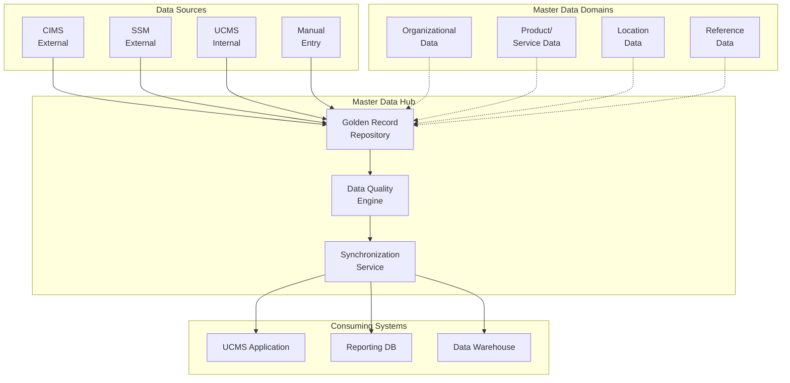
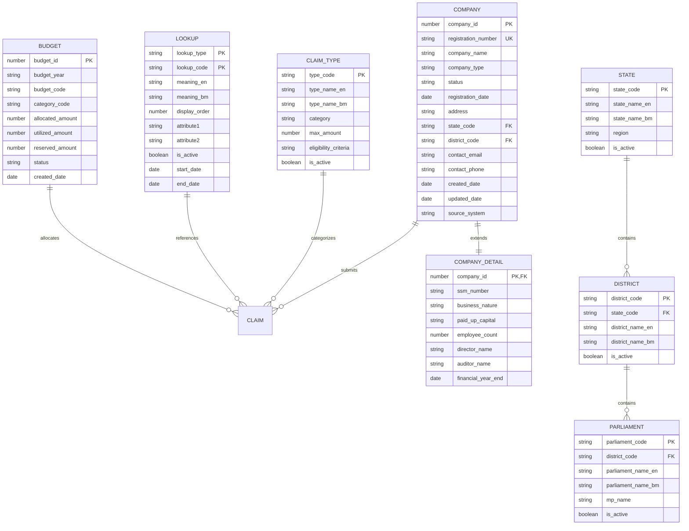
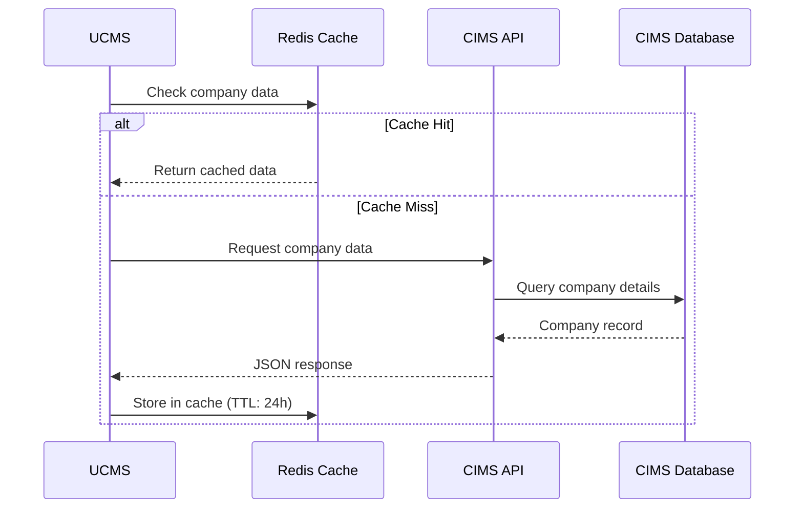
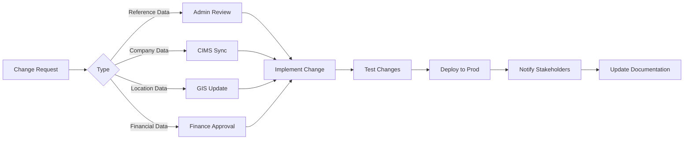

# ANNEX T12: MASTER DATA ARCHITECTURE
## TSH-2607: Universal Service Provision (USP) Claims Management System (UCMS)
**Document Reference:** ANNEX-T12-MASTER-DATA-TSH2607.md  
**Version:** 1.0  
**Date:** January 2025  
**Classification:** Technical Annexure

---

## 1. INTRODUCTION

This annexure defines the Master Data Management (MDM) architecture for the USP Claims Management System (UCMS). It covers the data model, reference data structures, data governance, and integration with external master data sources.

**Cross-References:**
- URS Section 9: Data Management Requirements
- BRS Section 9: Master Data Specifications
- SRS Section 13: Data Architecture
- SDS Section 11: Master Data Implementation

---

## 2. MASTER DATA ARCHITECTURE OVERVIEW

### 2.1 MDM Framework



### 2.2 Master Data Domains

| Domain | Description | Source System | Refresh Frequency |
|--------|-------------|---------------|-------------------|
| **Organizational** | Company data, user organizations | CIMS, SSM | Daily |
| **Product** | USP categories, equipment types | Internal + MCMC | As needed |
| **Location** | States, districts, parliamentary areas | Internal + JPN | Monthly |
| **Reference** | Status codes, lookup values | Internal | Real-time |
| **Financial** | Budget codes, GL accounts | Finance System | Daily |

---

## 3. MASTER DATA ENTITY MODEL

### 3.1 Entity Relationship Diagram



---

## 4. REFERENCE DATA SPECIFICATIONS

### 4.1 Lookup Tables

| Lookup Type | Description | Values (Sample) | Maintenance |
|-------------|-------------|-----------------|-------------|
| **CLAIM_STATUS** | Claim lifecycle status | DRAFT, PENDING, SCREENING, ASSESSMENT, APPROVED, REJECTED, PAID | System |
| **CLAIM_TYPE** | Types of USP claims | INFRASTRUCTURE, EQUIPMENT, TRAINING, RESEARCH | Admin |
| **COMPANY_TYPE** | Company classification | PUBLIC_LISTED, PRIVATE, SME, COOPERATIVE | CIMS |
| **USER_ROLE** | System roles | CLAIMANT, OFFICER, ASSESSOR, APPROVER, ADMIN | Admin |
| **DOCUMENT_TYPE** | Document categories | PROPOSAL, BUDGET, COMPANY_REG, FINANCIAL | Admin |
| **PAYMENT_STATUS** | Payment states | PENDING, PROCESSING, COMPLETED, FAILED, RECONCILED | System |
| **APPROVAL_LEVEL** | Approval hierarchy | LEVEL_1, LEVEL_2, LEVEL_3, LEVEL_4 | Admin |

### 4.2 State & District Master Data

```sql
-- State Master
CREATE TABLE ucms_states (
    state_code          VARCHAR2(2) PRIMARY KEY,
    state_name_en       VARCHAR2(100) NOT NULL,
    state_name_bm       VARCHAR2(100) NOT NULL,
    region              VARCHAR2(50),  -- NORTH, SOUTH, EAST, SABAH, SARAWAK
    is_active           CHAR(1) DEFAULT 'Y',
    created_date        DATE DEFAULT SYSDATE,
    created_by          VARCHAR2(50)
);

-- Sample Data
INSERT INTO ucms_states VALUES ('01', 'Johor', 'Johor', 'SOUTH', 'Y', SYSDATE, 'SYSTEM');
INSERT INTO ucms_states VALUES ('02', 'Kedah', 'Kedah', 'NORTH', 'Y', SYSDATE, 'SYSTEM');
INSERT INTO ucms_states VALUES ('03', 'Kelantan', 'Kelantan', 'EAST', 'Y', SYSDATE, 'SYSTEM');
INSERT INTO ucms_states VALUES ('04', 'Melaka', 'Melaka', 'SOUTH', 'Y', SYSDATE, 'SYSTEM');
INSERT INTO ucms_states VALUES ('05', 'Negeri Sembilan', 'Negeri Sembilan', 'SOUTH', 'Y', SYSDATE, 'SYSTEM');
INSERT INTO ucms_states VALUES ('06', 'Pahang', 'Pahang', 'EAST', 'Y', SYSDATE, 'SYSTEM');
INSERT INTO ucms_states VALUES ('07', 'Penang', 'Pulau Pinang', 'NORTH', 'Y', SYSDATE, 'SYSTEM');
INSERT INTO ucms_states VALUES ('08', 'Perak', 'Perak', 'NORTH', 'Y', SYSDATE, 'SYSTEM');
INSERT INTO ucms_states VALUES ('09', 'Perlis', 'Perlis', 'NORTH', 'Y', SYSDATE, 'SYSTEM');
INSERT INTO ucms_states VALUES ('10', 'Selangor', 'Selangor', 'CENTRAL', 'Y', SYSDATE, 'SYSTEM');
INSERT INTO ucms_states VALUES ('11', 'Terengganu', 'Terengganu', 'EAST', 'Y', SYSDATE, 'SYSTEM');
INSERT INTO ucms_states VALUES ('12', 'Sabah', 'Sabah', 'SABAH', 'Y', SYSDATE, 'SYSTEM');
INSERT INTO ucms_states VALUES ('13', 'Sarawak', 'Sarawak', 'SARAWAK', 'Y', SYSDATE, 'SYSTEM');
INSERT INTO ucms_states VALUES ('14', 'Kuala Lumpur', 'Kuala Lumpur', 'CENTRAL', 'Y', SYSDATE, 'SYSTEM');
INSERT INTO ucms_states VALUES ('15', 'Labuan', 'Labuan', 'SABAH', 'Y', SYSDATE, 'SYSTEM');
INSERT INTO ucms_states VALUES ('16', 'Putrajaya', 'Putrajaya', 'CENTRAL', 'Y', SYSDATE, 'SYSTEM');
```

### 4.3 District Master Sample

| District Code | State Code | District Name (EN) | District Name (BM) | Parliamentary Seats |
|---------------|------------|-------------------|-------------------|---------------------|
| 1001 | 10 | Gombak | Gombak | 4 |
| 1002 | 10 | Hulu Langat | Hulu Langat | 5 |
| 1003 | 10 | Hulu Selangor | Hulu Selangor | 3 |
| 1004 | 10 | Klang | Klang | 4 |
| 1005 | 10 | Kuala Langat | Kuala Langat | 3 |
| 1006 | 10 | Kuala Selangor | Kuala Selangor | 3 |
| 1007 | 10 | Petaling | Petaling | 5 |
| 1008 | 10 | Sabak Bernam | Sabak Bernam | 2 |
| 1009 | 10 | Sepang | Sepang | 3 |

---

## 5. COMPANY MASTER DATA INTEGRATION

### 5.1 CIMS Integration Model



### 5.2 Company Data Synchronization

| Data Element | Source | Update Frequency | Validation Rule |
|--------------|--------|------------------|-----------------|
| Company Name | CIMS | Daily | Match exact |
| Registration Number | CIMS | Daily | Format validation |
| Business Address | CIMS | Weekly | Address standardization |
| Contact Details | UCMS | Real-time | Email/phone format |
| Directors | CIMS | Monthly | List comparison |
| Share Capital | CIMS | Monthly | Numeric validation |
| Business Nature | CIMS | Monthly | Lookup validation |
| Company Status | CIMS | Daily | Active/Inactive |

### 5.3 Company Data Staging Table

```sql
CREATE TABLE ucms_company_staging (
    staging_id          NUMBER GENERATED ALWAYS AS IDENTITY PRIMARY KEY,
    cims_company_id     VARCHAR2(20),
    registration_number VARCHAR2(20),
    company_name        VARCHAR2(200),
    company_type        VARCHAR2(50),
    business_nature     VARCHAR2(100),
    registered_address  VARCHAR2(500),
    state_code          VARCHAR2(2),
    district_code       VARCHAR2(4),
    postcode            VARCHAR2(5),
    phone_number        VARCHAR2(20),
    fax_number          VARCHAR2(20),
    email_address       VARCHAR2(100),
    website             VARCHAR2(100),
    paid_up_capital     NUMBER(15,2),
    employee_count      NUMBER,
    director_names      CLOB,  -- JSON array
    auditor_name        VARCHAR2(100),
    financial_year_end  VARCHAR2(10),
    company_status      VARCHAR2(20),
    
    -- Sync metadata
    source_system       VARCHAR2(20) DEFAULT 'CIMS',
    sync_date           DATE DEFAULT SYSDATE,
    sync_status         VARCHAR2(20),  -- SUCCESS, FAILED, PENDING
    error_message       VARCHAR2(4000),
    
    -- Data quality flags
    is_validated        CHAR(1) DEFAULT 'N',
    validation_errors   CLOB,
    
    created_date        DATE DEFAULT SYSDATE
);
```

---

## 6. DATA QUALITY FRAMEWORK

### 6.1 Data Quality Dimensions

| Dimension | Definition | UCMS Application | Measurement |
|-----------|------------|------------------|-------------|
| **Completeness** | All required data present | Mandatory fields | % populated |
| **Accuracy** | Data reflects real-world | CIMS validation | Match rate |
| **Consistency** | Uniform across systems | Cross-system sync | Variance % |
| **Timeliness** | Data is current | Sync frequency | Age of data |
| **Validity** | Conforms to format rules | Field validation | Error rate |
| **Uniqueness** | No duplicate records | Duplicate detection | Duplicate % |

### 6.2 Data Quality Rules

| Entity | Rule ID | Rule Description | Severity |
|--------|---------|------------------|----------|
| Company | DQ-COMP-001 | Registration number must be unique | Critical |
| Company | DQ-COMP-002 | Email must be valid format | High |
| Company | DQ-COMP-003 | State code must exist in master | Critical |
| Claim | DQ-CLM-001 | Claim type must be valid | Critical |
| Claim | DQ-CLM-002 | Amount must be positive number | Critical |
| Claim | DQ-CLM-003 | Company must exist and be active | Critical |
| User | DQ-USER-001 | Email must be unique | Critical |
| User | DQ-USER-002 | Phone must be valid format | Medium |

---

## 7. MASTER DATA GOVERNANCE

### 7.1 Data Stewardship

| Data Domain | Data Steward | Steward Role | Responsibilities |
|-------------|--------------|--------------|------------------|
| Company Data | MCMC Operations | Operations Manager | Approve company updates, resolve conflicts |
| Location Data | MCMC Admin | System Administrator | Maintain state/district masters |
| Reference Data | MCMC Admin | System Administrator | Manage lookup values |
| User Data | Department Heads | HR/Manager | Approve user access requests |
| Financial Data | Finance Team | Finance Manager | Maintain budget codes, GL accounts |

### 7.2 Change Management Process



---

## 8. DOCUMENT CONTROL

| Version | Date | Author | Changes |
|---------|------|--------|---------|
| 1.0 | January 2025 | Data Architecture Team | Initial version |

---

**END OF ANNEX T12**
