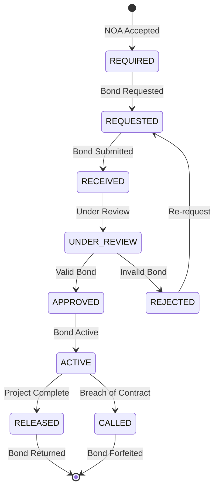

# ANNEX T16: BOND MANAGEMENT SCREEN
## TSH-2607: Universal Service Provision (USP) Claims Management System (UCMS)
**Document Reference:** ANNEX-T16-BOND-MGMT-TSH2607.md  
**Version:** 1.0  
**Date:** January 2025  
**Classification:** Technical Annexure

---

## 1. INTRODUCTION

This annexure details the Bond/Guarantee Management module screens and functionality for the USP Claims Management System (UCMS). The bond management module tracks performance bonds and advance payment bonds required from claimants.

**Cross-References:**
- URS Section 6.6: Bond Management Requirements
- BRS Section 5.5: Bond Specifications
- SRS Section 9.6: Bond Module Specifications
- SDS Section 7.6: Bond Screen Design

---

## 2. BOND MANAGEMENT OVERVIEW

### 2.1 Bond Types

| Bond Type | Code | Purpose | Percentage | Validity |
|-----------|------|---------|------------|----------|
| Performance Bond | PB | Ensure project completion | 5% of NOA value | Until project completion + 6 months |
| Advance Payment Bond | APB | Secure advance payments | Equal to advance amount | Until advance fully recovered |
| Retention Bond | RB | Alternative to cash retention | 10% of NOA value | Defect liability period |

### 2.2 Bond Lifecycle



---

## 3. BOND MANAGEMENT SCREENS

### 3.1 Bond Dashboard

```
+------------------------------------------------------------------+
|  [MCMC Logo]    BOND MANAGEMENT / PENGURUSAN BON      [Admin ▼]  |
+------------------------------------------------------------------+
|  [Dashboard] [Bonds] [Claims] [Reports] [Settings] [Audit] [BM]  |
+------------------------------------------------------------------+
|                                                                  |
|  BOND DASHBOARD / PAPAN PEMUKA BON                               |
|  ═══════════════════════════════════════════════════════════     |
|                                                                  |
|  +-------------------+  +-------------------+  +---------------+ |
|  | ACTIVE BONDS      |  | PENDING REVIEW    |  | EXPIRING <30d | |
|  | BON AKTIF         |  | MENUNGGU SEMakan  |  | TAMAT <30h    | |
|  |                   |  |                   |  |               | |
|  |        45         |  |        12         |  |       8       | |
|  |                   |  |                   |  |               | |
|  | [View / Lihat]    |  | [Review / Semak]  |  | [Alert]       | |
|  +-------------------+  +-------------------+  +---------------+ |
|                                                                  |
|  +------------------------------+  +--------------------------+  |
|  | BOND VALUE SUMMARY           |  | BOND BY TYPE             |  |
|  | JUMLAH NILAI BON             |  |                          |  |
|  |                              |  | [Pie Chart]              |  |
|  | Total Value / Jumlah:        |  |                          |  |
|  | RM 12,500,000.00             |  | PB: 60%  APB: 30%        |  |
|  |                              |  | RB: 10%                  |  |
|  | Released / Dilepaskan:       |  |                          |  |
|  | RM 8,200,000.00              |  |                          |  |
|  |                              |  |                          |  |
|  | Active / Aktif:              |  |                          |  |
|  | RM 4,300,000.00              |  |                          |  |
|  +------------------------------+  +--------------------------+  |
|                                                                  |
|  RECENT BOND ACTIVITY / AKTIVITI BON TERKINI                    |
|  +----------------------------------------------------------------+|
|  | Date/Tarikh | Bond Ref | Company | Type | Status | Amount   | |
|  |-------------|----------|---------|------|--------|----------| |
|  | 15/01/2025 | BOND-001 | Telekom | PB   | Active | 250,000 | |
|  | 14/01/2025 | BOND-002 | Maxis   | APB  | Review | 100,000 | |
|  | 13/01/2025 | BOND-003 | Celcom  | PB   | Released| 500,000| |
|  +----------------------------------------------------------------+|
|                                                                  |
+------------------------------------------------------------------+
```

### 3.2 Bond List View

```
+------------------------------------------------------------------+
|  BOND MANAGEMENT / PENGURUSAN BON                                |
|  ═══════════════════════════════════════════════════════════     |
|                                                                  |
|  +----------------------------------------------------------------+|
|  | 🔍 Search bonds... | Type: [All ▼] | Status: [All ▼] | [🔍] | |
|  +----------------------------------------------------------------+|
|                                                                  |
|  +------------------+  +-------------------+  +----------------+ |
|  | Show [25 ▼]      |  | Export [Excel ▼]  |  | [+ New Bond]   | |
|  +------------------+  +-------------------+  +----------------+ |
|                                                                  |
|  +----------------------------------------------------------------+|
|  | ☑ | Bond Ref    | Company        | Type | Status  | Amount    | Expiry     | Actions | |
|  |---|-------------|----------------|------|---------|-----------|------------|---------| |
|  | ☐ | BOND-2025-  | Telecom Msia   | PB   | 🟢Active| 250,000   | 31/07/2025 | [View]  | |
|  |   | 0012        |                |      |         |           |            |         | |
|  |---|-------------|----------------|------|---------|-----------|------------|---------| |
|  | ☐ | BOND-2025-  | Maxis Broadband| APB  | 🟡Review| 100,000   | 31/12/2025 | [View]  | |
|  |   | 0013        |                |      |         |           |            |         | |
|  |---|-------------|----------------|------|---------|-----------|------------|---------| |
|  | ☐ | BOND-2025-  | Celcom Axiata  | PB   | 🔴Called| 500,000   | Expired    | [View]  | |
|  |   | 0008        |                |      |         |           |            |         | |
|  |---|-------------|----------------|------|---------|-----------|------------|---------| |
|  | ☐ | BOND-2025-  | TIME dotCom    | RB   | 🟢Active| 300,000   | 30/06/2025 | [View]  | |
|  |   | 0015        |                |      |         |           |            |         | |
|  +----------------------------------------------------------------+|
|                                                                  |
|  +----------------------------------------------------------------+|
|  | Showing 1-4 of 45 records               [< Prev] 1 2 3 ... [Next >]||
|  +----------------------------------------------------------------+|
|                                                                  |
|  LEGEND: 🟢 Active | 🟡 Under Review | 🔴 Called/Expired | ⚪ Released |
|                                                                  |
+------------------------------------------------------------------+
```

### 3.3 Bond Detail View

```
+------------------------------------------------------------------+
|  < Back to Bond List / Kembali ke Senarai Bon                    |
|                                                                  |
|  BOND DETAILS / BUTIRAN BON                                      |
|  ═══════════════════════════════════════════════════════════     |
|                                                                  |
|  Bond Reference / Rujukan Bon:      BOND-2025-0012               |
|  Status / Status:                   🟢 ACTIVE / AKTIF            |
|                                                                  |
|  +---------------------+  +---------------------+  +-------------+|
|  | BOND INFORMATION    |  | RELATED NOA         |  | TIMELINE    ||
|  | MAKLUMAT BON        |  | NOA BERKAITAN       |  | GARIS MASA  ||
|  |                     |  |                     |  |             ||
|  | Type / Jenis: PB    |  | NOA-2025-0045       |  | • Required  ||
|  |                     |  |                     |  |   01/02/25  ||
|  | Amount / Jumlah:    |  | Claim / Tuntutan:   |  | • Received  ||
|  | RM 250,000.00       |  | UC-2025-0147        |  |   05/02/25  ||
|  |                     |  |                     |  | • Approved  ||
|  | Bank / Bank:        |  | Company / Syarikat: |  |   10/02/25  ||
|  | Maybank Berhad      |  | Telecom Malaysia    |  | • Active    ||
|  |                     |  |                     |  |   10/02/25  ||
|  | Ref No / No Ruj:    |  | Amount / Jumlah:    |  |             ||
|  | MB-2025-888777      |  | RM 5,000,000        |  |             ||
|  |                     |  |                     |  |             ||
|  | Issue Date:         |  | [View NOA]          |  |             ||
|  | 01/02/2025          |  |                     |  |             ||
|  |                     |  |                     |  |             ||
|  | Expiry Date:        |  |                     |  |             ||
|  | 31/07/2025          |  |                     |  |             ||
|  |                     |  |                     |  |             ||
|  | Validity: 180 days  |  |                     |  |             ||
|  +---------------------+  +---------------------+  +-------------+|
|                                                                  |
|  +-------------------------------------------------------------+ |
|  | DOCUMENTS / DOKUMEN                                 [Upload] | |
|  +-------------------------------------------------------------+ |
|  | Filename               | Type      | Date       | Status    | |
|  |------------------------|-----------|------------|-----------| |
|  | bond_certificate.pdf   | Original  | 05/02/2025 | ✓ Verified| |
|  | bank_guarantee.pdf     | Supporting| 05/02/2025 | ✓ Verified| |
|  +----------------------------------------------------------------+|
|                                                                  |
|  +-------------------------------------------------------------+ |
|  | HISTORY / SEJARAH                                            | |
|  +-------------------------------------------------------------+ |
|  | Date       | Action              | User        | Notes       | |
|  |------------|---------------------|-------------|-------------| |
|  | 10/02/2025 | Bond Approved       | Ahmad (Admin)| Valid docs | |
|  | 05/02/2025 | Bond Received       | System      | Auto-logged | |
|  | 01/02/2025 | Bond Required       | System      | NOA accepted| |
|  +----------------------------------------------------------------+|
|                                                                  |
|  ACTIONS / TINDAKAN:                                             |
|  +------------+  +------------+  +------------+  +-------------+ |
|  | [📄 View   |  | [✓ Release |  | [⚠ Call   |  | [✉ Notify   | |
|  |  Document] |  |  Bond]     |  |  Bond]     |  |  Expiry]    | |
|  +------------+  +------------+  +------------+  +-------------+ |
|                                                                  |
+------------------------------------------------------------------+
```

### 3.4 Bond Registration Form

```
+------------------------------------------------------------------+
|  REGISTER NEW BOND / DAFTAR BON BARU                             |
|  ═══════════════════════════════════════════════════════════     |
|                                                                  |
|  1. BOND DETAILS / BUTIRAN BON                                   |
|  ----------------------------------------------------------------|
|                                                                  |
|  Related NOA / NOA Berkaitan: *                                  |
|  +-------------------------------------------------------------+ |
|  | [Search NOA...                                          ▼] | |
|  | NOA-2025-0045 - Telecom Malaysia - RM 5,000,000              | |
|  +-------------------------------------------------------------+ |
|                                                                  |
|  Bond Type / Jenis Bon: *                                        |
|  +-----------------------------+  +-----------------------------+ |
|  | [Performance Bond (PB)    ▼] |  |                             | |
|  +-----------------------------+  +-----------------------------+ |
|    • Performance Bond (PB) - 5% of project value                 |
|    • Advance Payment Bond (APB) - Equal to advance amount        |
|    • Retention Bond (RB) - 10% alternative to cash retention     |
|                                                                  |
|  Bond Amount / Jumlah Bon: *                                     |
|  +----------------------------------------------------------------+|
|  | RM 250,000.00                                                 ||
|  +----------------------------------------------------------------+|
|  <i> Calculated as 5% of NOA value / Dikira sebagai 5% nilai NOA </i>
|                                                                  |
|  2. BANK INFORMATION / MAKLUMAT BANK                             |
|  ----------------------------------------------------------------|
|                                                                  |
|  Issuing Bank / Bank Pengeluar: *                                |
|  +-------------------------------------------------------------+ |
|  | [Malayan Banking Berhad (Maybank)                       ▼] | |
|  +-------------------------------------------------------------+ |
|                                                                  |
|  Bank Reference Number / Nombor Rujukan Bank: *                  |
|  +----------------------------------------------------------------+|
|  | MB-2025-888777                                                ||
|  +----------------------------------------------------------------+|
|                                                                  |
|  Bank Branch / Cawangan Bank:                                    |
|  +----------------------------------------------------------------+|
|  | Menara Maybank, Jalan Tun Perak, Kuala Lumpur                 ||
|  +----------------------------------------------------------------+|
|                                                                  |
|  3. VALIDITY / TEMPOH SAH                                        |
|  ----------------------------------------------------------------|
|                                                                  |
|  Issue Date / Tarikh Dikeluarkan: *         Expiry Date: *       |
|  +-------------------------------+  +---------------------------+ |
|  | [📅 01/02/2025]               |  | [📅 31/07/2025]          | |
|  +-------------------------------+  +---------------------------+ |
|                                                                  |
|  Validity Period / Tempoh Sah: 180 days                          |
|                                                                  |
|  4. DOCUMENTS / DOKUMEN                                          |
|  ----------------------------------------------------------------|
|                                                                  |
|  Bond Certificate / Sijil Bon: *          [Choose File / Pilih]  |
|  Bank Guarantee / Jaminan Bank:           [Choose File / Pilih]  |
|                                                                  |
|  +----------------------------------------------------------------+|
|  | Allowed formats: PDF, JPG, PNG (Max 10MB per file)            | |
|  +----------------------------------------------------------------+|
|                                                                  |
|  5. REMARKS / CATATAN                                            |
|  ----------------------------------------------------------------|
|  +----------------------------------------------------------------+|
|  |                                                               ||
|  |                                                               ||
|  +----------------------------------------------------------------+|
|                                                                  |
|  +-------------------+  +--------------------------------------+  |
|  |  CANCEL / BATAL   |  |  SUBMIT BOND / HANTAR BON            |  |
|  +-------------------+  +--------------------------------------+  |
|                                                                  |
+------------------------------------------------------------------+
```

---

## 4. BOND DATABASE SCHEMA

```sql
-- Bond Master Table
CREATE TABLE ucms_bonds (
    bond_id                 VARCHAR2(20) PRIMARY KEY,
    noa_id                  VARCHAR2(20) NOT NULL REFERENCES ucms_noa(noa_id),
    claim_id                VARCHAR2(20) NOT NULL REFERENCES ucms_claims(claim_id),
    company_id              VARCHAR2(20) NOT NULL REFERENCES ucms_companies(company_id),
    
    -- Bond Details
    bond_type               VARCHAR2(3) CHECK (bond_type IN ('PB', 'APB', 'RB')),
    bond_status             VARCHAR2(20) DEFAULT 'REQUIRED' CHECK (
                                bond_status IN ('REQUIRED', 'REQUESTED', 'RECEIVED', 
                                              'UNDER_REVIEW', 'APPROVED', 'ACTIVE', 
                                              'RELEASED', 'CALLED', 'REJECTED')
                            ),
    bond_amount             NUMBER(15,2) NOT NULL,
    currency                VARCHAR2(3) DEFAULT 'MYR',
    
    -- Bank Information
    issuing_bank            VARCHAR2(100) NOT NULL,
    bank_reference_no       VARCHAR2(50),
    bank_branch             VARCHAR2(200),
    bank_contact_person     VARCHAR2(100),
    bank_contact_phone      VARCHAR2(20),
    
    -- Dates
    required_date           DATE,
    requested_date          DATE,
    received_date           DATE,
    approved_date           DATE,
    issue_date              DATE,
    expiry_date             DATE,
    released_date           DATE,
    called_date             DATE,
    
    -- Review Information
    reviewed_by             VARCHAR2(50),
    review_date             DATE,
    review_notes            VARCHAR2(4000),
    
    -- Release Information
    released_by             VARCHAR2(50),
    release_reason          VARCHAR2(4000),
    release_reference       VARCHAR2(50),
    
    -- Call Information
    called_by               VARCHAR2(50),
    call_reason             VARCHAR2(4000),
    call_amount             NUMBER(15,2),
    
    -- Document References
    bond_certificate_doc_id VARCHAR2(20),
    bank_guarantee_doc_id   VARCHAR2(20),
    
    -- Audit
    created_by              VARCHAR2(50) DEFAULT USER,
    created_date            DATE DEFAULT SYSDATE,
    modified_by             VARCHAR2(50),
    modified_date           DATE
);

-- Bond History/Activity Log
CREATE TABLE ucms_bond_history (
    history_id              NUMBER GENERATED ALWAYS AS IDENTITY PRIMARY KEY,
    bond_id                 VARCHAR2(20) REFERENCES ucms_bonds(bond_id),
    activity_type           VARCHAR2(50),
    activity_date           DATE DEFAULT SYSDATE,
    performed_by            VARCHAR2(50),
    old_status              VARCHAR2(20),
    new_status              VARCHAR2(20),
    notes                   VARCHAR2(4000)
);

-- Bond Alert Configuration
CREATE TABLE ucms_bond_alerts (
    alert_id                NUMBER GENERATED ALWAYS AS IDENTITY PRIMARY KEY,
    bond_id                 VARCHAR2(20) REFERENCES ucms_bonds(bond_id),
    alert_type              VARCHAR2(20) CHECK (alert_type IN ('EXPIRY_30D', 'EXPIRY_14D', 'EXPIRY_7D', 'EXPIRED')),
    alert_date              DATE,
    notification_sent       CHAR(1) DEFAULT 'N',
    notification_date       DATE,
    acknowledged            CHAR(1) DEFAULT 'N',
    acknowledged_by         VARCHAR2(50),
    acknowledged_date       DATE
);
```

---

## 5. BOND VALIDATION RULES

| Rule ID | Rule Description | Validation |
|---------|------------------|------------|
| BOND-001 | Bond amount must match required percentage | Compare to NOA value |
| BOND-002 | Expiry date must be after project end date | Check against project timeline |
| BOND-003 | Bank must be from approved list | Validate against bank master |
| BOND-004 | Bond reference must be unique | Check uniqueness |
| BOND-005 | Document must be valid PDF/image | File type validation |
| BOND-006 | Issue date cannot be in future | Date validation |
| BOND-007 | Expiry date must be after issue date | Date range validation |

---

## 6. DOCUMENT CONTROL

| Version | Date | Author | Changes |
|---------|------|--------|---------|
| 1.0 | January 2025 | UI/UX Team | Initial version |

---

**END OF ANNEX T16**
