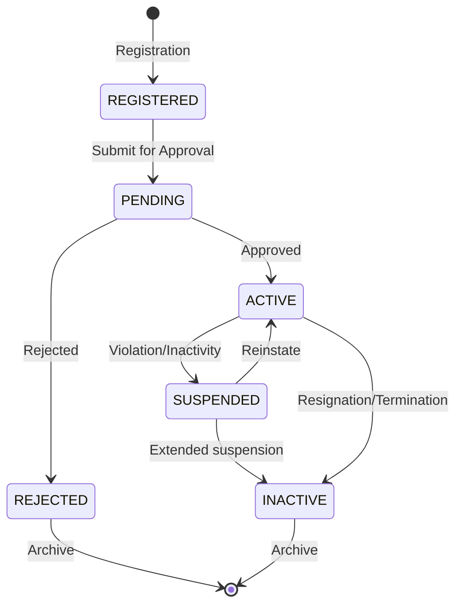

# ANNEX T17: USER MANAGEMENT MODULE
## TSH-2607: Universal Service Provision (USP) Claims Management System (UCMS)
**Document Reference:** ANNEX-T17-USER-MGMT-TSH2607.md  
**Version:** 1.0  
**Date:** January 2025  
**Classification:** Technical Annexure

---

## 1. INTRODUCTION

This annexure details the User Management Module for the USP Claims Management System (UCMS). The module provides comprehensive user lifecycle management, role-based access control, and security administration.

**Cross-References:**
- URS Section 5.1: User Management Requirements
- BRS Section 4.1: User Administration
- SRS Section 8.1: User Module Specifications
- SDS Section 6.1: User Management Design

---

## 2. USER MANAGEMENT ARCHITECTURE

### 2.1 User Types

| User Type | Code | Description | Registration Method |
|-----------|------|-------------|---------------------|
| Internal User | INT | MCMC staff | Admin provisioning |
| External User - Company | EXT-C | Company representatives | Self-registration + approval |
| External User - Individual | EXT-I | Individual claimants | Self-registration + approval |
| Auditor | AUD | External auditors | Admin invitation |
| System Administrator | SYS | IT administrators | Direct DB provisioning |

### 2.2 User Lifecycle



---

## 3. USER MANAGEMENT SCREENS

### 3.1 User Dashboard

```
+------------------------------------------------------------------+
|  [MCMC Logo]    USER MANAGEMENT / PENGURUSAN PENGGUNA  [Admin ▼] |
+------------------------------------------------------------------+
|  [Dashboard] [Users] [Roles] [Permissions] [Audit] [Settings]    |
+------------------------------------------------------------------+
|                                                                  |
|  USER DASHBOARD / PAPAN PEMUKA PENGGUNA                          |
|  ═══════════════════════════════════════════════════════════     |
|                                                                  |
|  +-------------------+  +-------------------+  +---------------+ |
|  | TOTAL USERS       |  | ACTIVE USERS      |  | PENDING       | |
|  | JUMLAH PENGGUNA   |  | PENGGUNA AKTIF    |  | MENUNGGU      | |
|  |                   |  |                   |  |               | |
|  |      1,247        |  |      1,156        |  |      23       | |
|  |                   |  |                   |  |               | |
|  | [View / Lihat]    |  | [View / Lihat]    |  | [Review]      | |
|  +-------------------+  +-------------------+  +---------------+ |
|                                                                  |
|  +-------------------+  +-------------------+  +---------------+ |
|  | SUSPENDED         |  | INACTIVE          |  | NEW (7 days)  | |
|  | DITANGGUH         |  | TIDAK AKTIF       |  | BARU (7 hari) | |
|  |                   |  |                   |  |               | |
|  |        18         |  |        50         |  |      34       | |
|  +-------------------+  +-------------------+  +---------------+ |
|                                                                  |
|  USER DISTRIBUTION BY TYPE / PENAGAIHAN PENGGUNA MENGIKUT JENIS  |
|  +-------------------------------------------------------------+ |
|  |                                                             |  |
|  |  [Bar Chart: Internal 45% | Company 40% | Individual 12%   |  |
|  |             | Auditor 3%]                                   |  |
|  |                                                             |  |
|  +-------------------------------------------------------------+ |
|                                                                  |
|  RECENT ACTIVITY / AKTIVITI TERKINI                              |
|  +----------------------------------------------------------------+|
|  | Time/Masa | User/Pengguna | Action/Tindakan | Status | By/Oleh||
|  |-----------|---------------|-----------------|--------|--------||
|  | 10:23 AM  | Ahmad Abdullah| Registration    | Pending| System ||
|  | 09:45 AM  | Sarah Tan     | Role Change     | Active | Admin  ||
|  | 09:12 AM  | John Smith    | Password Reset  | Active | Self   ||
|  | 08:56 AM  | Company ABC   | Approved        | Active | Manager||
|  +----------------------------------------------------------------+|
|                                                                  |
+------------------------------------------------------------------+
```

### 3.2 User List View

```
+------------------------------------------------------------------+
|  USER MANAGEMENT / PENGURUSAN PENGGUNA                           |
|  ═══════════════════════════════════════════════════════════     |
|                                                                  |
|  +----------------------------------------------------------------+|
|  | 🔍 Search users... | Type: [All ▼] | Status: [All ▼] | Dept ▼ | |
|  +----------------------------------------------------------------+|
|                                                                  |
|  +------------------+  +-------------------+  +----------------+ |
|  | Show [25 ▼]      |  | Export [Excel ▼]  |  | [+ Add User]   | |
|  +------------------+  +-------------------+  +----------------+ |
|                                                                  |
|  +----------------------------------------------------------------+|
|  |☑ | User ID  | Name            | Email              | Type | Role     | Status | Last Login| Actions | |
|  |--|----------|-----------------|--------------------|------|----------|--------|-----------|---------| |
|  |☐ | US-001   | Ahmad Abdullah  | ahmad@mcmc.gov.my  | INT  | Officer  | 🟢Act  | Today     | [Edit]  | |
|  |--|----------|-----------------|--------------------|------|----------|--------|-----------|---------| |
|  |☐ | US-045   | Sarah Tan       | sarah@telekom.com  | EXT-C| Claimant | 🟢Act  | Yesterday | [Edit]  | |
|  |--|----------|-----------------|--------------------|------|----------|--------|-----------|---------| |
|  |☐ | US-089   | John Smith      | john@audit.com     | AUD  | Auditor  | 🟢Act  | 2 days ago| [Edit]  | |
|  |--|----------|-----------------|--------------------|------|----------|--------|-----------|---------| |
|  |☐ | US-156   | New User        | new@company.com    | EXT-C| -        | 🟡Pen  | Never     | [Review]||
|  +----------------------------------------------------------------+|
|                                                                  |
|  Bulk Actions / Tindakan Pukal: [Select Action ▼] [Apply]        |
|                                                                  |
+------------------------------------------------------------------+
```

### 3.3 User Detail View

```
+------------------------------------------------------------------+
|  < Back / Kembali                                                |
|                                                                  |
|  USER DETAILS / BUTIRAN PENGGUNA                                 |
|  ═══════════════════════════════════════════════════════════     |
|                                                                  |
|  [👤 Profile Picture Placeholder]                                |
|                                                                  |
|  User ID / ID Pengguna:         US-000789                        |
|  Status / Status:               🟢 ACTIVE / AKTIF                |
|                                                                  |
|  +------------------------+  +-------------------------------+   |
|  | PERSONAL INFO          |  | ACCOUNT INFO                  |   |
|  | MAKLUMAT PERIBADI      |  | MAKLUMAT AKAUN                |   |
|  |                        |  |                               |   |
|  | Full Name:             |  | Username:                     |   |
|  | AHMAD BIN ABDULLAH     |  | ahmad.abdullah                |   |
|  |                        |  |                               |   |
|  | Email:                 |  | User Type:                    |   |
|  | ahmad@mcmc.gov.my      |  | Internal (MCMC Staff)         |   |
|  |                        |  |                               |   |
|  | Phone:                 |  | Department:                   |   |
|  | +60 12-345 6789        |  | USP Division                  |   |
|  |                        |  |                               |   |
|  | Employee ID:           |  | Role:                         |   |
|  | MCMC-2020-0123         |  | Claims Officer                |   |
|  |                        |  |                               |   |
|  | Position:              |  | Last Login:                   |   |
|  | Senior Officer         |  | 15 Jan 2025, 09:30 AM         |   |
|  |                        |  |                               |   |
|  | Join Date:             |  | Password Expiry:              |   |
|  | 15 March 2020          |  | 15 April 2025                 |   |
|  |                        |  |                               |   |
|  |                        |  | MFA Status:                   |   |
|  |                        |  | ✅ Enabled (Authenticator App)|   |
|  +------------------------+  +-------------------------------+   |
|                                                                  |
|  +-------------------------------------------------------------+ |
|  | PERMISSIONS / KEBENARAN                                      | |
|  +-------------------------------------------------------------+ |
|  | Module            | View | Create | Edit | Delete | Approve  | |
|  |-------------------|------|--------|------|--------|----------| |
|  | Claims            |  ✓   |   ✓    |  ✓   |   -    |    -     | |
|  | Documents         |  ✓   |   ✓    |  -   |   -    |    -     | |
|  | Reports           |  ✓   |   ✓    |  ✓   |   -    |    -     | |
|  | User Management   |  -   |   -    |  -   |   -    |    -     | |
|  +----------------------------------------------------------------+|
|                                                                  |
|  +-------------------------------------------------------------+ |
|  | LOGIN HISTORY / SEJARAH LOG MASUK                            | |
|  +-------------------------------------------------------------+ |
|  | Date & Time         | IP Address    | Browser      | Status   | |
|  |---------------------|---------------|--------------|----------| |
|  | 15/01/2025 09:30:23 | 192.168.1.100 | Chrome 120   | Success  | |
|  | 14/01/2025 16:45:12 | 192.168.1.100 | Chrome 120   | Success  | |
|  | 14/01/2025 08:12:05 | 10.0.0.55     | Firefox 121  | Success  | |
|  +----------------------------------------------------------------+|
|                                                                  |
|  ACTIONS / TINDAKAN:                                             |
|  +--------+  +--------+  +----------+  +---------+  +----------+ |
|  | [Edit] |  |[Reset  |  |[Suspend] |  |[Disable]|  |[Delete]  | |
|  |        |  |Password]|  |          |  |         |  |(Admin)   | |
|  +--------+  +--------+  +----------+  +---------+  +----------+ |
|                                                                  |
+------------------------------------------------------------------+
```

### 3.4 User Registration Form

```
+------------------------------------------------------------------+
|  REGISTER NEW USER / DAFTAR PENGGUNA BARU                        |
|  ═══════════════════════════════════════════════════════════     |
|                                                                  |
|  USER TYPE / JENIS PENGGUNA: *                                   |
|  +-------------------------------------------------------------+ |
|  | ⚫ Internal User / Pengguna Dalam                            | |
|  |    MCMC Staff Only / Kakitangan MCMC Sahaja                  | |
|  |                                                              | |
|  | ⚪ External User - Company / Pengguna Luar - Syarikat        | |
|  |    Company Representatives / Wakil Syarikat                  | |
|  |                                                              | |
|  | ⚪ External User - Individual / Pengguna Luar - Individu     | |
|  |    Individual Claimants / Pemohon Individu                   | |
|  |                                                              | |
|  | ⚪ Auditor / Juruaudit                                       | |
|  |    External Audit Personnel / Kakitangan Audit Luar          | |
|  +-------------------------------------------------------------+ |
|                                                                  |
|  PERSONAL INFORMATION / MAKLUMAT PERIBADI                        |
|  ----------------------------------------------------------------|
|                                                                  |
|  Full Name / Nama Penuh: *                                       |
|  +----------------------------------------------------------------+|
|  |                                                               ||
|  +----------------------------------------------------------------+|
|                                                                  |
|  Email / Emel: *                           Phone / Telefon: *    |
|  +-------------------------------+  +---------------------------+ |
|  |                               |  |                           | |
|  +-------------------------------+  +---------------------------+ |
|                                                                  |
|  Employee ID / ID Pekerja:                                       |
|  +----------------------------------------------------------------+|
|  | (For internal users only / Untuk pengguna dalaman sahaja)    ||
|  +----------------------------------------------------------------+|
|                                                                  |
|  Department / Jabatan: *              Position / Jawatan: *      |
|  +-------------------------------+  +---------------------------+ |
|  | [USP Division             ▼] |  | [Select Position        ▼]| |
|  +-------------------------------+  +---------------------------+ |
|                                                                  |
|  ROLE ASSIGNMENT / TUGASAN PERANAN                               |
|  ----------------------------------------------------------------|
|                                                                  |
|  Primary Role / Peranan Utama: *                                 |
|  +-------------------------------------------------------------+ |
|  | [Claims Officer                                         ▼] | |
|  +-------------------------------------------------------------+ |
|  • View and process claims / Lihat dan proses tuntutan           |
|  • Upload documents / Muat naik dokumen                          |
|  • Generate reports / Jana laporan                               |
|                                                                  |
|  Additional Roles / Peranan Tambahan:                            |
|  [ ] Backup Approver / Penyelia Gantian                          |
|  [ ] Department Admin / Pentadbir Jabatan                        |
|                                                                  |
|  ACCOUNT SETTINGS / TETAPAN AKAUN                                |
|  ----------------------------------------------------------------|
|                                                                  |
|  Username / Nama Pengguna: *                                     |
|  +----------------------------------------------------------------+|
|  |                                                               ||
|  +----------------------------------------------------------------+|
|  <i> Auto-generated if left blank / Dijana auto jika dibiarkan kosong </i>
|                                                                  |
|  Temporary Password:                                             |
|  +-------------------+  +--------------------------------------+ |
|  | [Auto-generate]   |  | [Custom Password]                    | |
|  +-------------------+  +--------------------------------------+ |
|                                                                  |
|  [✓] Force password change on first login                        |
|       Paksa tukar kata laluan semasa log masuk pertama           |
|                                                                  |
|  [✓] Enable MFA / Dayakan MFA                                    |
|       (Recommended for admin roles / Disyorkan untuk peranan admin)
|                                                                  |
|  +-------------------+  +--------------------------------------+ |
|  |  CANCEL / BATAL   |  |  REGISTER USER / DAFTAR PENGGUNA     | |
|  +-------------------+  +--------------------------------------+ |
|                                                                  |
+------------------------------------------------------------------+
```

---

## 4. USER DATABASE SCHEMA

```sql
-- User Master Table
CREATE TABLE ucms_users (
    user_id                 VARCHAR2(20) PRIMARY KEY,
    user_type               VARCHAR2(10) CHECK (user_type IN ('INT', 'EXT-C', 'EXT-I', 'AUD', 'SYS')),
    user_status             VARCHAR2(20) DEFAULT 'PENDING' CHECK (
                                user_status IN ('REGISTERED', 'PENDING', 'ACTIVE', 
                                              'SUSPENDED', 'INACTIVE', 'REJECTED')
                            ),
    
    -- Personal Information
    full_name               VARCHAR2(200) NOT NULL,
    email                   VARCHAR2(100) NOT NULL UNIQUE,
    phone                   VARCHAR2(20),
    employee_id             VARCHAR2(20),
    department_code         VARCHAR2(10),
    position                VARCHAR2(100),
    
    -- Account Information
    username                VARCHAR2(50) NOT NULL UNIQUE,
    password_hash           VARCHAR2(255) NOT NULL,
    password_expiry_date    DATE,
    force_password_change   CHAR(1) DEFAULT 'N',
    
    -- Company Information (for external users)
    company_id              VARCHAR2(20),
    company_role            VARCHAR2(50),
    
    -- MFA
    mfa_enabled             CHAR(1) DEFAULT 'N',
    mfa_secret              VARCHAR2(100),
    mfa_backup_codes        CLOB,  -- JSON array
    
    -- Security
    failed_login_attempts   NUMBER DEFAULT 0,
    locked_until            DATE,
    last_login_date         DATE,
    last_login_ip           VARCHAR2(50),
    session_token           VARCHAR2(255),
    
    -- Audit
    created_by              VARCHAR2(50),
    created_date            DATE DEFAULT SYSDATE,
    modified_by             VARCHAR2(50),
    modified_date           DATE,
    approved_by             VARCHAR2(50),
    approved_date           DATE
);

-- User Roles
CREATE TABLE ucms_user_roles (
    assignment_id           NUMBER GENERATED ALWAYS AS IDENTITY PRIMARY KEY,
    user_id                 VARCHAR2(20) REFERENCES ucms_users(user_id),
    role_code               VARCHAR2(20) REFERENCES ucms_roles(role_code),
    assigned_by             VARCHAR2(50),
    assigned_date           DATE DEFAULT SYSDATE,
    valid_from              DATE DEFAULT SYSDATE,
    valid_until             DATE,
    is_primary              CHAR(1) DEFAULT 'N'
);

-- User Login History
CREATE TABLE ucms_login_history (
    login_id                NUMBER GENERATED ALWAYS AS IDENTITY PRIMARY KEY,
    user_id                 VARCHAR2(20) REFERENCES ucms_users(user_id),
    login_time              DATE DEFAULT SYSDATE,
    logout_time             DATE,
    ip_address              VARCHAR2(50),
    user_agent              VARCHAR2(500),
    browser                 VARCHAR2(100),
    os                      VARCHAR2(100),
    login_status            VARCHAR2(20),  -- SUCCESS, FAILED, LOCKED
    failure_reason          VARCHAR2(200)
);

-- Password History
CREATE TABLE ucms_password_history (
    history_id              NUMBER GENERATED ALWAYS AS IDENTITY PRIMARY KEY,
    user_id                 VARCHAR2(20) REFERENCES ucms_users(user_id),
    password_hash           VARCHAR2(255),
    changed_date            DATE DEFAULT SYSDATE,
    changed_by              VARCHAR2(50)
);
```

---

## 5. USER VALIDATION RULES

| Rule ID | Rule Description | Validation |
|---------|------------------|------------|
| USR-001 | Email must be unique | Check ucms_users table |
| USR-002 | Username must be unique | Check ucms_users table |
| USR-003 | Password must meet complexity | Min 12 chars, mixed case, number, symbol |
| USR-004 | Employee ID required for internal users | Conditional validation |
| USR-005 | Company ID required for external company users | Conditional validation |
| USR-006 | Phone number must be valid format | Regex validation |
| USR-007 | Cannot reuse last 12 passwords | Check password history |

---

## 6. DOCUMENT CONTROL

| Version | Date | Author | Changes |
|---------|------|--------|---------|
| 1.0 | January 2025 | Security Team | Initial version |

---

**END OF ANNEX T17**
